# 目录
[TOC]

# C++
## C++基本概念
### 面向对象的三个基本特征
* 封装
* 继承
* 多态

### 继承与组合
#### 继承
1. **公有继承（public）**：公有继承的特点是基类的公有成员和保护成员作为派生类的成员时，它们都保持原有的状态，而基类的私有成员仍然是私有的，不能被这个派生类的子类所访问。
2. **私有继承（private）**：私有继承的特点是基类的公有成员和保护成员都作为派生类的私有成员，并且不能被这个派生类的子类所访问。
3. **保护继承（protected）**：保护继承的特点是基类的所有公有成员和保护成员都成为派生类的保护成员，并且只能被它的派生类成员函数或友元访问，基类的私有成员仍然是私有的。
4. **C++中struct与class的区别**：默认的继承访问权限。struct是public的，class是private的。

#### 组合
A类里面包含B类的对象，并且使用B类的功能，例如：
```c++
/**
 * 动物
 */
public class Animal {
    public void breathing() {
        System.out.println("呼气...吸气...");
    }
}
/**
 * 爬行动物
 * 组合
 */
public class Reptilia {

    private Animal animal;

    public Reptilia(Animal animal) {
        this.animal = animal;
    }

    public void crawling() {
        System.out.println("爬行...");
    }
    public void breathing() {
        animal.breathing();
    }


    public static void main(String[] args) {
        Animal animal = new Animal();
        Reptilia reptilia = new Reptilia(animal);
        reptilia.breathing();;
        reptilia.crawling();
    }
}

```

### 构造函数
构造函数不能是虚函数，虚函数的调用是通过虚函数表来查找的，虚函数表需要通过构造函数来完成初始化。在调用构造函数前虚函数表还没建立，所以构造函数不能是虚函数。

### 析构函数
* 析构函数可以是虚函数，因为这个时候虚函数表已经初始化。
* 析构函数也常常是虚函数。特别是存在继承关系时，若父类的析构函数不是虚函数，则使用delete删除子类指针时，只释放父类，不释放子类，会造成内存泄漏。

### 对象实例化
* 在栈上创建对象：classA a; 程序自动析构，先构造的后析构。
* 在堆上创建对象：classA *a = new classA(); 需要执行delete才能析构。

### 模板特化
指明模板中的类型，使模板函数对某种类型特例化。例如下面的全特化例子中，普通的cmp模板函数比较t1和t2的大小，但当t1、t2的类型为```char*```时运算符“==”比较的是它们的首地址。所以为了比较```char*```类型需要对```char*```类型进行特化。

#### 全特化
```c++
#include <iostream>
#include <cstring>
using namespace std;
template<typename T>
class A {
  public:
    bool cmp(const T &t1, const T &t2) {
        return t1 == t2;
    }
};
template<>
class A<char*> {   // 这里是全特化，仍然需要tempalte<>声明
  public:
    bool cmp(const char* t1, const char* t2) {
        while(*t1 != '\0' && *t2 != '\0') {
            if(*t1 != *t2) {
                return false;
            }
            ++t1;
            ++t2;
        }
        return true;
    }
};
```
上面的例子就是全特化，模板类全部特化为具体的类型```char*```。

#### 偏特化
部分模板类进行特化，如下面的例子。函数没有偏特化。
```c++
#include <iostream>
#include <cstring>
using namespace std;

template<typename T, typename T1>
class A {
  public:
    A() = default;
    A(const T1& n) {
        cout << n << endl;
    }
    bool cmp(const T &t1, const T &t2) {
        return t1 == t2;
    }
};

template<typename T1>  // 片特化
class A<char*, T1> {
  public:
    A() = default;
    A(T1& n) {
        cout << n << endl;
    }
    bool cmp(const char* t1, const char* t2) {
        while(*t1 != '\0' && *t2 != '\0') {
            if(*t1 != *t2) {
                return false;
            }
            ++t1;
            ++t2;
        }
        return true;
    }
};
int main() {
    char* p1 = "hello";
    char* p2 = "hello";
    A<int, char*>c(p1);
    cout << c.cmp(1, 2) << endl;
    A<char*, char*>c1(p2);  // 即使是片特化，也要全部声明模板
    cout << c1.cmp(p1, p2) << endl;
    return 0;
}
```

### 指针和引用的区别
* 指针是存放内存地址的一种变量，而引用的本质是变量的别名。
* 指针指向的是一个内存地址， 因此可以指向一块为0x00000000的地址，声明时可以暂时不初始化（不推荐），即pointer = NULL；引用是变量的别名，别名就一定对应着一个“本名”，因此必须在声明时就初始化，且不能初始化为空。
* 指针可以重新赋值，使它可以在不同的时期指向不同的对象，而引用必须从一而终。

### 重载、重写、隐藏
#### 重载
重载从overload翻译过来，是指同一可访问区内被声明的几个具有不同参数列表（参数的类型，个数，顺序不同）的同名函数，根据参数列表确定调用哪个函数，重载不关心函数返回类型。重载的特性包括：

* 相同的范围（在同一个作用域中）。
* 函数名字相同。
* 参数不同列表。
* virtual关键字可有可无。
* 返回类型可以不同。

#### 重写
重写翻译自override，是指派生类中存在重新定义的函数。其函数名，参数列表，返回值类型，所有都必须同基类中被重写的函数一致。只有函数体不同（花括号内），派生类调用时会调用派生类的重写函数，不会调用被重写函数。重写的基类中被重写的函数必须有virtual修饰。重写的特性包括：

* 不在同一个作用域（分别位于派生类与基类）。
* 函数名字相同。
* 参数相同列表（参数个数，两个参数列表对应的类型）。
* 基类函数必须有virtual关键字，不能有 static，大概是多态的原因吧。
* 返回值类型（或是协变），否则报错。
* 重写函数的访问修饰符可以不同。尽管virtual是private的，派生类中重写改写为public、protected也是可以的。

#### 隐藏
隐藏是指派生类的函数屏蔽了与其同名的基类函数。注意只要同名函数，不管参数列表是否相同，基类函数都会被隐藏。隐藏的特性包括：

* 不在同一个作用域（分别位于派生类与基类）。
* 函数名字相同。
* 返回类型可以不同。
* 参数不同，此时，不论有无virtual关键字，基类的函数将被隐藏（注意别与重载混淆）而不是被重写。
* 参数相同，但是基类函数没有virtual关键字。此时，基类的函数被隐藏（注意别与覆盖混淆）。

## C++基本特性
### const和constptr的区别
const修饰运行时常量；constptr修饰编译期常量，修饰的对象在编译期间就能计算完毕（是不是不能修饰表达式？）。

### new的作用
对于内置类型而言，new仅仅是分配内存，除非后面显示加(),相当于调用它的构造函数，对于自定义类型而言，只要一调用new，那么编译器不仅仅给它分配内存，还调用它的默认构造函数初始化，即使后面没有加()。

### for循环中++i和i++的区别
仅仅是形式不同，对结果不产生影响。

### 枚举
对于枚举中的全局变量，
如果是函数外定义那么是0 。
如果是函数内定义，那么是随机值，因为没有初始化，不存储在内存的静态存储区。

### 虚函数
* 虚函数不是类的成员函数。
* 虚函数一般用来定义类接口，告诉程序员要在子类中实现这些接口。

#### 纯虚函数
纯虚函数是一种特殊的虚函数，在许多情况下，在基类中不能对虚函数给出有意义的实现，而把它声明为纯虚函数，它的实现留给该基类的派生类去做。这就是纯虚函数的作用。\
纯虚函数也可以叫抽象函数，一般来说它只有函数名、参数和返回值类型，不需要函数体。这意味着它没有函数的实现，需要让派生类去实现。\
C++中的纯虚函数，一般在函数签名后使用=0作为此类函数的标志。Java、C#等语言中，则直接使用abstract作为关键字修饰这个函数签名，表示这是抽象函数(纯虚函数)。

示例：
```c++
class <类名>
{
virtual <类型><函数名>(<参数表>)=0;
…
};
```
基类：
```c++
class A {
public:
    A();
    virtual ~A();
    void f1();
    virtual void f2();
    virtual void f3()=0;
};
```
子类：
```c++
class B:public A{
public:
    B();
    virtual ~B();
    void f1();
    virtual void f2();
    virtual void f3();
};
```
主函数：
```c++
int main(int argc,char * argv[]) {
    A *m_j = new B();
    m_j -> f1();
    m_j -> f2();
    m_j -> f3();
    delete m_j;
    return 0;
}
```

### 浅拷贝和深拷贝
浅拷贝与深拷贝的区别可见[CSDN博客](https://www.cnblogs.com/wjcoding/p/10955017.html)。

举个栗子：
```c++
/* 没有重载=之前 */
A a ;
A b; 
a = b; 
// 这里是赋值操作。 
A a; 
A b = a;  
// 这里是浅拷贝操作。 

/* 重载 = 之后 */
A a ; 
A b; 
a = b; 
// 这里是深拷贝操作。 
A a; 
A b = a;  
// 这里还是浅拷贝操作。
```

### 继承
父类指针指向子类实例对象，调用普通重写方法时，会调用父类中的方法。而调用被子类重写的虚函数时，会调用子类中的方法。

### 内存管理
#### 堆、栈、自由存储区、全局/静态存储区
在C++中，内存空间分为：栈、堆、自由存储区、全局/静态存储区、常量存储区。

* **栈**：在执行函数时，函数内局部变量的存储单元都可以在栈上创建，函数执行结束是这些存储单元自动被释放。栈内存分配运算内置于处理器的指令集中，效率高，分配的内存容量有限。
* **堆**：就是那些由malloc等分配的内存块，用free释放内存。
* **自由存储区**：那些由new分配的内存块，由应用程序去控制，一般一个new就要对应一个delete，如果程序员没有释放掉，那么在程序结束后操作系统会自动回收。自由存储区只是C++中的抽象概念，编译器通常通过堆实现自由存储区，程序员也可通过重载运算符使用其他内存区域作为自由存储区。
* **全局/静态存储区**：全局变量和静态变量被分配到同一块内存中，在以前的C语言中全局变量又分为初始化的和未初始化的，在C++里面没有这个区分了，他们共同占用同一块内存区。
* **常量存储区**：这是一块比较特殊的存储区，他们里面存放的是常量，不允许修改。

#### 堆和自由存储区的区别与联系
* 堆是C语言和操作系统的术语、是操作系统维护的一块内存，而自由存储是C++中通过new与delete动态分配和释放对象的抽象概念。堆与自由存储区并不等价。
* new所申请的内存区域在C++中称为自由存储区。藉由堆实现的自由存储，可以说new所申请的内存区域在堆上。

#### 堆和栈的区别
* **管理方式**：对于栈来讲，是由编译器自动管理，无需我们手工控制；对于堆来说，释放工作由程序员控制，容易产生memory leak（内存泄漏、内存溢出）。
* **空间大小**：一般在32位系统下，堆内存可以达到4G的空间，从这个角度来看堆内存几乎是没有什么限制的。但是对于栈来讲，一般都是有一定的空间大小的，默认的栈空间大小是1M。Linux系统设置栈大小方法：“ulimit -a”显示当前用户栈大小，“ulimit -s X”将当前用户栈大小设置成XKB。
* **碎片问题**：对于堆来讲，频繁的malloc/free势必会造成内存空间的不连续，从而造成大量的碎片，使程序效率降低。栈是先进后出的队列，以至于永远都不可能有一个内存块从栈中间弹出。
* **分配方式**：堆都是动态分配的，没有静态分配的堆。栈有2种分配方式：静态分配和动态分配。静态分配是编译器完成的，比如局部变量的分配。动态分配由alloca函数进行分配，但是栈的动态分配和堆是不同的，它的动态分配是由编译器进行释放，无需我们手工实现。
* **分配效率**：栈是机器系统提供的数据结构，计算机会在底层对栈提供支持：分配专门的寄存器存放栈的地址，压栈出栈都有专门的指令执行，这就决定了栈的效率比较高。堆则是C/C++函数库提供的，它的机制是很复杂的，例如为了分配一块内存，库函数会按照一定的算法在堆内存中搜索可用的足够大小的空间，如果没有足够大小的空间（可能是由于内存碎片太多），就有可能调用系统功能去增加程序数据段的内存空间，这样就有机会分到足够大小的内存，然后进行返回。显然，堆的效率比栈要低得多。

#### 关于内存的一些编程习惯总结
* 用malloc或new申请内存之后，应该立即检查指针值是否为NULL。防止使用指针值为NULL的内存。
* 不要忘记为数组和动态内存赋初值。防止将未被初始化的内存作为右值使用。
* 避免数组或指针的下标越界，特别要当心发生“多1”或者“少1”操作。
* 动态内存的申请与释放必须配对，防止内存泄漏。
* 用free或delete释放了内存之后，立即将指针设置为NULL，防止产生“野指针”。

#### malloc线程安全
目前看到的主流平台Win/*nix的主流编译器都是线程安全的。部分规模较大的嵌入式环境也是线程安全的。少部分微型的嵌入式操作系统不是线程安全的（因为可能没有多线程的概念）。因为线程安全，所以malloc和free会加锁（具体是哪种锁就看情况了），多核的情况下会严重降低效率，所以不要用的太多。

如果并发量高、分配频繁，可以考虑用tcmalloc。

### static关键字的作用
* 保持内容持久：static修饰的变量存在静态存储区，具有全局生存期。
* 默认初始化为0：static修饰的变量如果在初始化时不赋值，则默认为零。
* 类成员中声明static：使成员成为全局类成员而不是对象的成员。
* 隐藏：当同时编译多个文件时，所有未加static的全局变量和函数都具有全局可见性，但加上static后的变量，只在当前文件可见。

### inline和宏定义的区别
内联函数和宏定义都是在预处理的位置将代码展开，不需要像普通函数那样需要额外的时间和空间开销。

### union关键字
共用体，也叫联合体，在一个“联合”内可以定义多种不同的数据类型， 一个被说明为该“联合”类型的变量中，允许装入该“联合”所定义的任何一种数据，这些数据共享同一段内存，以达到节省空间的目的。union变量所占用的内存长度等于最长的成员的内存长度。

#### 宏定义的缺点
* 没有参数类型检查，和参数类型转换。
* 不能访问类的成员变量。
* 宏定义使用参数时，是严格的替换策略，无论你得参数时是何种形式，在展开代码中都是用形参数代替实参，这样，宏定义很容易产生二义性，它的使用就存在一系列的隐患。

#### 内联函数的优点
* 有参数类型检查，更加安全。
* 内联函数是在程序运行时展开，而且是进行参数传递。在编译时将函数体嵌入每一个调用处，编译时，类似宏替换，使用函数体替换调用处的函数名，在代码中用inline关键字修饰，在类中声明的成员函数，自动转换为内联函数。
* inline关键字只是对编译器的一个定义，如果函数本地不符合内联函数的标准，编译器就会将这个函数当作是普通函数。
* 类中的成员函数默认是内联函数(要求成员函数没有循环和递归，当其中存在循环的递归的时候，编译器会将其默认为一个普通函数处理)。

#### 内联函数缺点
* 不允许有循环或递归。
* 内联函数的定义必须出现在第一次调用内联函数之前。
* 因为内联函数是在调用处展开，所以会使代码边长，占用更多内存。

#### 内联函数与宏定义的区别
* 内联函数在运行时可调试，而宏定义不可以。
* 编译器会对内联函数的参数类型做安全检查或自动类型转换，而宏定义则不会。
* 内联函数可以访问类的成员变量，而宏定义则不能。

### malloc()、free()函数的实现
#### 进程地址空间构成
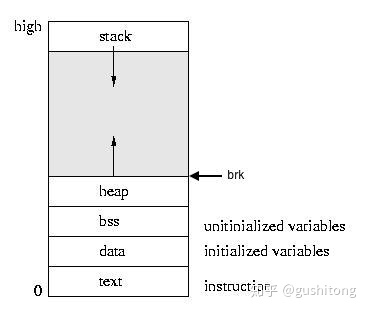

每个Linux进程都有一个地址空间，逻辑上由以下五部分组成：
* **text**：代码段，包含形成程序可执行代码的机器指令。它是由编译器和汇编器把C、C++或者其他程序的源码转化为机器码产生的。通常，代码段只读。
* **data**：包含所有已初始化的程序变量、字符串、数字和其他数据的存储。
* **bss**：包含所有未初始化的静态数据，这些数据将被初始化为0。
* **heap**：包含进程动态申请的内存。向上增长。
* **stack**：包含局部变量、函数参数、指针拷贝。向下增长。

其中，data、bss、heap统称为**数据段**。heap的顶部被一个**brk(break)**指针标示，在heap申请内存时需要请求操作系统增加brk，而在heap上释放内存时需要请求操作系统减小brk。

Linux/Unix类操作系统提供了一个**sbrk**系统调用，可以用于修改brk指针。
```c
#include <unistd.h>
sbrk(0);    // 返回当前brk指针的地址
sbrk(x);    // brk指针增加x字节，内存被申请
sbrk(-x);   // brk指针减少x字节，内存被释放
```

#### malloc()的实现
malloc函数的基本实现：
```c
void *malloc(size_t size)
{
    void *block;
    block = sbrk(size);
    if (block == (void*) - 1)
        return NULL;
    return block;
}
```
其中，void*是一个特殊的指针，其值为0。\
如果想释放一块malloc申请的内存，我们需要知道这块内存的首地址、该内存块的大小、该内存块是否被标记为free，我们把记录以上这些数据的结构体叫作**header_t**。
```c
struct header_t
{
    size_t size;        // 内存块大小
    unsigned is_free;   // 当前内存块是否已被标记为free
};
```
特别地，若当前进程申请的内存不连续（比如其他进程在当前进程运行期间调用sbrk申请了内存），则还需要维护一个header_t链表。\
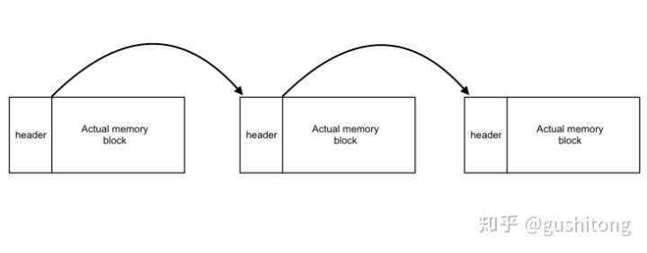
```c
struct header_t
{
    size_t size;            // 内存块大小
    unsigned char is_free;  // 当前内存块是否已被标记为free
    struct header_t *next;  // 下一个内存块的地址，用于维护header_t链表
};
```
设置header_t链表的head和tail以便于对链表进行追踪：
```c
struct header_t *head, *tail;
```
使用一个简单的线程锁来保证内存分配器是线程安全的（其他线程/进程可能也正要调用malloc，加锁以防止数据污染）：
```c
#include <pthread.h>
pthread_mutex_t global_malloc_lock;
```
综上，比较完整的malloc()函数实现如下：
```c
struct header_t *get_free_block(size_t size)
{
    struct header_t *curr = head;
    while (curr)
    {
        if (curr->is_free && curr->size >= size)
            return curr;
        curr = curr->next;
    }
    return NULL;
};
void *malloc(size_t size)
{
	size_t total_size;
	void *block;
	struct header_t *header;
	if (!size)
		return NULL;
	pthread_mutex_lock(&global_malloc_lock);
	header = get_free_block(size);
	if (header) {
		header->is_free = 0;
		pthread_mutex_unlock(&global_malloc_lock);
		return (void*)(header + 1);
	}
	total_size = sizeof(struct header_t) + size;
	block = sbrk(total_size);
	if (block == (void*) -1) {
		pthread_mutex_unlock(&global_malloc_lock);
		return NULL;
	}
	header = block;
	header->size = size;
	header->is_free = 0;
	header->next = NULL;
	if (!head)
		head = header;
	if (tail)
		tail->next = header;
	tail = header;
	pthread_mutex_unlock(&global_malloc_lock);
	return (void*)(header + 1);
}
```
分析以上代码：
* 如果所申请内存的size为0，返回NULL。
* 申请线程锁，遍历内存块组成的链表，查找是否有满足size并且标记为free的内存块。
* 如果找到了，将该内存块标记为non-free，释放线程锁，返回该内存快的地址。
* 如果没有找到符合条件的内存块，那么我们从heap的顶部重新申请新的内存块，内存的大小: ```total_size = sizeof(struct header_t) + size```，然后调用sbrk(total_size)修改brk指针。

#### free()函数的实现
free() 首先要确定当前要释放的内存块是否位于heap的顶部（链表的尾部）。如果是的话，release it to the OS. 如果不是的话，标记为free，便于以后重用。
```c
void free(void *block)
{
	struct header_t *header, *tmp;
	void *programbreak;

	if (!block)
		return;
	pthread_mutex_lock(&global_malloc_lock);
	header = (struct header_t*)block - 1;

	programbreak = sbrk(0);
	if ((char*)block + header->size == programbreak) {
		if (head == tail) {
			head = tail = NULL;
		} else {
			tmp = head;
			while (tmp) {
				if(tmp->next == tail) {
					tmp->next = NULL;
					tail = tmp;
				}
				tmp = tmp->next;
			}
		}
		sbrk(0 - sizeof(struct header_t) - header->size);
		pthread_mutex_unlock(&global_malloc_lock);
		return;
	}
	header->is_free = 1;
	pthread_mutex_unlock(&global_malloc_lock);
} 
```

### mmap()函数
mmap()用来实现内存与文件之间的映射。

### using关键字
* using可以用来选择命名空间，比如常用的std命名空间：using namespace std;。
* using与也可以发挥类似于宏定义的作用，比如下面的例子用view_t来指代ArrayView<_T, _Rank>：
```c++
using view_t = ArrayView<_T,_Rank>;
view_t& array_view_;
```

### 类和结构体所占内存大小
类所占内存的大小是由成员变量（static修饰的静态变量除外）决定的，成员函数是不计算在内的。\
举两个栗子：

#### 例1
```c++
class A
{
private:
    char a1;
    short a2;
    int a3;
    long a4;
public:
    A(){}
};
struct B
{
    char b1;
    short b2;
    int b3;
    long b4;
};
int main()
{
    cout << sizeof(char) << endl;
    cout << sizeof(short) << endl;
    cout << sizeof(int) << endl;
    cout << sizeof(long) << endl;
    A a;
    cout << sizeof(A) << ',' << sizeof(a) << endl;
    B b;
    cout << sizeof(B) << ',' << sizeof(b) << endl;
    return 0;
}

```
输出结果：
```
1
2
4
4
12,12
12,12
```
说明本例中类和结构体都是4字节（32位）对齐。对齐位数和处理器、操作系统有关，在编译时也可以设置。

#### 例2
```c++
class A
{
public:
    char a1:1;
    short a2:1;
    int a3:1;
    //long a4:1;
    A(){}
};
struct B
{
    //char b1:2;
    //short b2:4;
    int b3:1;
    long b4:31;
};
int main()
{
    A a, *pa;
    cout << sizeof(A) << ',' << sizeof(a) << ',' << sizeof(pa) << endl;
    B b, *pb;
    cout << sizeof(B) << ',' << sizeof(b) << ',' << sizeof(pb) << endl;
    return 0;
}
```
输出结果：
```
8,8,8
4,4,8
```
说明位域可以改变变量实际所占的位数。

## C++ STL标准模板库
### map
#### 底层数据结构
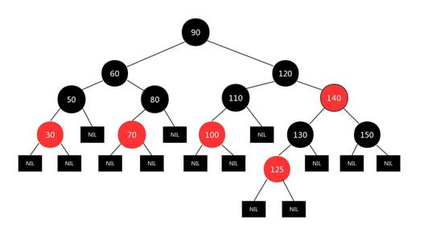

红黑树
#### 红黑树的性质
* 节点是红色或黑色。
* 根节点是黑色。
* 所有叶子节点是黑色（叶子节点是NUIL）。
* 每个红色节点的子节点都是黑色（从每个叶子到根的所有路径上不能有两个连续的红色节点）。
* 从任一节点到其每个叶子的所有路径都包含相同数目的黑色节点。

#### 红黑树的特点
* 搜索时间复杂度为logN。
* 与普通AVL相比允许最大深度是最小深度的2倍（普通AVL允许最大深度比最小深度多2层）。
* 维护开销比AVL更低。

#### 节点插入
* 根据一般二叉查找树的插入步骤， 把新节点 z 插入到 某个叶节点的位置上，然后将 z 着 为红色。 为了保证红黑树的性质能继续保持，再对有关节点重新着色并旋转。
* 如果新插入的是黑色节点，那么它所在的路径上就多出一个黑色的节点，所以新插入的节点一定要设成红色。 但是如果z的父节点也是红色，这就违反了每个红色节点的两个子节点都黑色的性质。

#### 节点删除
* 若删除的节点是红色，则不做任何操作，红黑树的任何属性都不会被破坏。
* 若删除的节点是黑色的，显然它所 在的路径上就少一个黑色节点，红黑树的性质就被破坏了，这时执行一个Delete-Fixup()函数来修补这棵树。 一个节点被删除之后，一定 有一个它的节点代替了它的位置，即使是叶节点被删除后，也会有一个空节点来代替它的位置。

#### 用法
##### 检测map对象中是否已包含某元素
```c++
map.count(key) // 若返回结果大于0，则包含key
```
或
```c++
if (map.find(key) != map.end()) // 若条件为真，则包含key
```

##### map[10]=20这种操作和insert(pair<int, int>(10, 20))有什么区别？
* 当key=10存在的时候，map[10]=20会用20去覆盖原来的值，而insert什么都不做。
* []操作符会多调用一次实值对象的构造函数产生一个默认对象，而真正的产生作用的是对默认对象的赋值。

##### map遍历删除所有元素
```c++
for (auto iter = a.begin(); iter != a.end(); ++iter) 
    a.erase(iter);
```
删除后当前迭代器会失效，通过iter=iter+1使迭代器指向下一个元素。

### unordered_map
#### 底层数据结构
哈希表

#### 接口
与map相似

#### 与map比较
优点：哈希表查找时间复杂度是常量级，红黑树查找时间复杂度是logN。\
缺点：无序，对于某些需要按序存储的情形，map更胜任。

#### load_factor
详见 http://www.cplusplus.com/reference/unordered_map/unordered_map/max_load_factor/ \
加载因子\
The load factor influences the probability of collision in the hash table (i.e., the probability of two elements being located in the same bucket). The container uses the value of max_load_factor as the threshold that forces an increase in the number of buckets (and thus causing a rehash).

Note though, that implementations may impose an upper limit on the number of buckets (see max_bucket_count), which may force the container to ignore the max_load_factor.

#### void reserve(size_type n)
详见 http://www.cplusplus.com/reference/unordered_map/unordered_map/reserve/ \
设置哈希桶个数\
Sets the number of buckets in the container (bucket_count) to the most appropriate to contain at least n elements.

If n is greater than the current bucket_count multiplied by the max_load_factor, the container's bucket_count is increased and a rehash is forced.

If n is lower than that, the function may have no effect.

By calling reserve with the size we expected for the unordered_map container we avoided the multiple rehashes that the increases in container size could have produced and optimized the size of the hash table.

### vector
#### emplace_back()
类似于push_back函数，但不同，在vector后方创建一个与参数相同的元素，而push_back是将参数的引用推入后方。

#### reserve()
vector 的reserve增加了vector的capacity，但是它的size没有改变！而resize改变了vector的capacity同时也增加了它的size。

 reserve是容器预留空间，但在空间内不真正创建元素对象，所以在没有添加新的对象之前，不能引用容器内的元素。加入新的元素时，要调用push_back()/insert()函数。

### copy()
#### 头文件
```c++
#include <vector>
```
#### 在两个容器之间复制元素
```c++
copy(源首地址, 源末地址, 目标首地址);
```

### priority_queue
优先级队列，可实现堆排序
#### 用法示例
```c++
#include <queue>
std::priority_queue<Type, Container, Func>
```
大顶堆：
```c++
priority_queue<int, vector<int>> heap1; // 默认大顶堆，最大的元素先出队
priority_queue<int, vector<int>, less<int>> heap1b;
```
小顶堆
```c++
priority_queue<int, vector<int>, greater<int>> heap2;
```

## C++11新特性
### 智能指针
#### 基本特性
* 智能指针利用了一种叫做RAII（资源获取即初始化）的技术对普通的指针进行封装，这使得智能指针实质上是一个对象，行为表现的却像一个指针。
* 智能指针的作用是防止忘记调用delete释放内存和程序异常的计入catch块忘记释放内存。另外指针释放时机也非常有考究。

#### unique_ptr\<T>
##### 分配内存
与shared_ptr不同，C++11标准中unique_ptr没有定义类似make_shared的操作（C++14中有make_unique\<T\>()），因此只可以使用new来分配内存，并且由于unique_ptr不可拷贝和赋值，初始化unique_ptr必须使用直接初始化的方式。
```c++
unique_ptr<int> up1(new int());    //okay,直接初始化
unique_ptr<int> up2 = new int();   //error! 构造函数是explicit
unique_ptr<int> up3(up1);          //error! 不允许拷贝
```

##### 销毁指向的对象
在析构函数中销毁。

##### 接口
```c++
unique_ptr<T> up; // 空的unique_ptr，可以指向类型为T的对象，默认使用delete来释放内存
unique_ptr<T,D> up(d); // 空的unique_ptr同上，接受一个D类型的删除器d，使用删除器d来释放内存
up = nullptr; // 释放up指向的对象，将up置为空
up.release(); // up放弃对它所指对象的控制权，并返回保存的指针，将up置为空，不会释放内存
up.reset(…); // 参数可以为 空、内置指针，先将up所指对象释放，然后重置up的值.
```

##### 传值
一个unique_ptr将指向的内容传递给另一个unique_ptr对象：
```c++
unique_ptr<int> p1 = make_unique<int>();
unique_ptr<int> p2 = std::move(p1);
```

#### shared_ptr\<T>
共享计数指针。

##### 作用
多线程程序经常会遇到在某个线程A创建了一个对象,这个对象需要在线程B使用，在没有shared_ptr时,因为线程A,B结束时间不确定,即在A或B线程先释放这个对象都有可能造成另一个线程崩溃，所以为了省时间一般都是任由这个内存泄漏发生。当然也可以经过复杂的设计，由一个监控线程来统一删除，但这样会增加代码量和复杂度.这下好了,shared_ptr 可以方便的解决问题,因为它是引用计数和线程安全的。shared_ptr不用手动去释放资源，它会智能地在合适的时候去自动释放。

##### 原理
当多个shared_ptr管理同一个指针，仅当最后一个shared_ptr析构时，指针才被delete。这是怎么实现的呢？答案是：引用计数（reference counting）。引用计数指的是，所有管理同一个裸指针（raw pointer）的shared_ptr，都共享一个引用计数器，每当一个shared_ptr被赋值（或拷贝构造）给其它shared_ptr时，这个共享的引用计数器就加1，当一个shared_ptr析构或者被用于管理其它裸指针时，这个引用计数器就减1，如果此时发现引用计数器为0，那么说明它是管理这个指针的最后一个shared_ptr了，于是我们释放指针指向的资源。

### 参数包
详见[CppRef](https://en.cppreference.com/w/cpp/language/parameter_pack)。\
A template parameter pack is a template parameter that accepts zero or more template arguments (non-types, types, or templates). A function parameter pack is a function parameter that accepts zero or more function arguments. A template with at least one parameter pack is called a variadic template (可变模板)。

### std::conditional
#### 用法
```c++
#include <type_traits>
template< bool B, class T, class F >
struct conditional;
```
type T if B==true, F if B==false

#### 示例
```c++
#include <iostream>
#include <type_traits>
#include <typeinfo>
int main() 
{
    typedef std::conditional<true, int, double>::type Type1;
    typedef std::conditional<false, int, double>::type Type2;
    typedef std::conditional<sizeof(int) >= sizeof(double), int, double>::type Type3;
 
    std::cout << typeid(Type1).name() << '\n';
    std::cout << typeid(Type2).name() << '\n';
    std::cout << typeid(Type3).name() << '\n';
}
```
上述代码的输出：
```
i
d
d
```

### default constructors
详见[CppRef](https://en.cppreference.com/w/cpp/language/default_constructor)\
A default constructor is a constructor which can be called with no arguments (either defined with an empty parameter list, or with default arguments provided for every parameter). A type with a public default constructor is DefaultConstructible.

### noexcept
参考 https://www.cnblogs.com/sword03/p/10020344.html

从C++11开始，我们能看到很多代码当中都有关键字noexcept。比如下面就是std::initializer_list的默认构造函数，其中使用了noexcept。
```c++
constexpr initializer_list() noexcept
    : _M_array(0), _M_len(0) { }
```
该关键字告诉编译器，函数中不会发生异常,这有利于编译器对程序做更多的优化。
如果在运行时，noexecpt函数向外抛出了异常（如果函数内部捕捉了异常并完成处理，这种情况不算抛出异常），程序会直接终止，调用std::terminate()函数，该函数内部会调用std::abort()终止程序。

# 高性能计算
## 并行数值算法

## 并行程序设计

## CUDA
### 锁页内存
host端存在虚拟内存。**锁页内存**就是分配host端内存时锁定该页，让其不与磁盘（虚拟内存）交换。

#### 使用锁页内存的好处
* 设备内存与锁页内存之间的数据传输可以与内核执行并行处理。
* 锁页内存可以映射到设备内存，减少设备与主机的数据传输。
* 在前端总线的主机系统锁页内存与设备内存之间的数据交换会比较快；并且可以是write-combining的，此时带宽会跟大。

#### 锁页内存分配与释放
CUDA提供了锁页内存分配与释放的接口：
```c++
cudaError_t cudaHostAlloc(void **host_pointer, size_t size, unsigned int flags); // 分配内存
cudaError_t cudaFreeHost(void **host_pointer); // 释放内存
```
其中flags有如下标志：
* cudaHostAllocDefault：指定默认行为。
* cudaHostAllocWriteCombined：用于只被传输到设备的内存区域。当主机要从这块内存区域**读取时不要使用这个标志**。它在主机处理器上关闭了内存区域的缓存，这意味着在传输时它完全忽略了内存区域。这在特定的硬件配置上能够加速到设备的传输。
* cudaHostAllocPortable：锁页内存在所有CUDA上下文中变成锁页的和可见的。默认情况下，内存分配属于创建它的上下文。如果你打算在CUDA上下文之间或主机处理器的线程之间传递指针，则必须使用这个标志。
* cudaHostAllocMapped：将主机内存分配到设备内存空间，这允许GPU内核直接读取和写入，所有的传输将隐式地处理。

### 线程内存模式
线程布局会影响SM内cache的命中率。

### 脉动阵列（systolic array）

# 数据结构与算法
## 搜索算法
### 深度优先搜索（DFS）
具有回溯能力，适合少量长结果搜索，可通过栈或递归实现，借助栈确定搜索顺序。

### 广度优先搜索（BFS）
适合大量短结果搜索，可通过队列实现，借助队列确定搜索顺序。

## 排序算法
### 排序算法的稳定性
设有一数组a，在经过排序后，原数组a中任意两个值相等的元素顺序不变，则该排序算法是稳定的，否则不稳定。

### 快速排序
时间复杂度为NlogN。\
示例代码：
```c++
#include <vector>
#include <cstdlib>
#include <iostream>
#include <algorithm>
using namespace std;
void qsort(vector<int>& arr, const int& low, const int& high)
{
    if (low >= high) return;
    int i = low;
    int j = high + 1;
    int key = arr[low];
    while (true)
    {
        /* 从左向右找比key大的值 */
        while (arr[++i] <= key)
            if (i == high) break;
        /* 从右向左找比key小的值 */
        while (arr[--j] >= key)
            if (j == low) break;
        if (i >= j) break;
        swap(arr[i], arr[j]);
    }
    /* 替换中枢值 */
    swap(arr[low], arr[j]);
    /* 如此一来，中枢左边的值都比中枢右边的小 */
    qsort(arr, low, j - 1);
    qsort(arr, j + 1, high);
}
int main()
{
    vector<int> arr = {5, 3, 7, 6, 4, 1, 0, 2, 9, 10, 8};
    /* 快速排序 */
    qsort(arr, 0, arr.size() - 1);
    for (const int& ele : arr)
        cout << ele << ' ';
    cout << endl;
    return 0;
}
```
快速排序与归并排序的思路是相反的。

### 堆排序
如果要进行升序排序，那么先建立大顶堆，然后把堆顶元素与堆尾元素交换。时间复杂度为NlogN。

示例代码：
```c++
#include <vector>
#include <algorithm>
#include <iostream>
#include <cstdlib>
using namespace std;
inline int left(const int& i) { return 2 * i + 1; }
inline int right(const int& i) { return 2 * i + 2; }
void heapSort(vector<int>& arr, const int& i, const int& tail)
{
    if (i < 0 || i > tail)
        return;
    int l = left(i), r = right(i);
    if (r < tail && arr[i] < arr[r])
    {
        swap(arr[i], arr[r]);
        heapSort(arr, r, tail);
    }
    else if (l < tail && arr[i] < arr[l])
    {
        swap(arr[i], arr[l]);
        heapSort(arr, l, tail);
    }
    heapSort(arr, i - 1, tail);
}
int main()
{
    vector<int> arr;// = {4, 6, 8, 5, 9};
    while (arr.size() < 20)
        arr.emplace_back(rand());
    /* 做一个大顶堆 */
    int tmpI = arr.size() / 2 - 1;
    heapSort(arr, tmpI, arr.size());
    for (const int& ele : arr)
        cout << ele << " ";
    cout << endl;
    /* 调整堆结构 */
    for (int tail = arr.size() - 1; tail > 0; tail--)
    {
        if (arr[0] > arr[tail])
            swap(arr[0], arr[tail]);
        heapSort(arr, 0, tail);
    }
    for (const int& ele : arr)
        cout << ele << " ";
    cout << endl;
    return 0;
}
```

## 字典树（Trie树）
又称“前缀树”、“Trie树”，是一种哈希树的变种。典型应用是用于统计，排序和保存大量的字符串（但不仅限于字符串），所以经常被搜索引擎系统用于文本词频统计。它的优点是：利用字符串的公共前缀来减少查询时间，最大限度地减少无谓的字符串比较，查询效率比哈希树高。

## 二叉树
### 性质
二叉树的 出度=入度=节点数-1.

## 最长公共子序列（Longest Common Sub-sequence, LCS）
可参考 https://zhuanlan.zhihu.com/p/47591838 \
动态规划递推式：
```c++
// 计算出字符串str_a、str_b的最长公共子序列长度
string str_a, str_b;
// 初始化
L[0:I][0] = 0; L[0][0:J] = 0;
// 递推
for (size_t i = 1; i < I; i++)
    for (size_t j = 1; j < J; j++)
    {
        
        L[i][j] = max(L[i-1][j], L[i][j-1]);
        if (str_a[i] == str_b[j])
            L[i][j] = max(L[i][j], L[i-1][j-1] + 1);
    }
return L[I-1][J-1];
```

## 检验一个整数是否是回文数
```c++
bool isReverse(const int& x)
{
    int tmp = 0, xs = x;
    while (x)
    {
        tmp = tmp * 10 + x % 10;
        x = x / 10;
    }
    return xs == tmp;
}
```
## 检验一个整数是否是素数
```c++
bool isPrime(const int& x)
{
    if (x == 0 || x == 1) return false;
    for (int i = 2; i <= x / 2; i++)
        if (x % i == 0)
            return false;
    return true;
}
```

## 马拉车算法（Manacher Algorithm）
### 适用场景
求一个字符串中最长回文子串

### 示例代码
参考 https://zhuanlan.zhihu.com/p/70532099 \
```c++
string str; // 输入的字符串
// 预处理，在字符串前方和后方插入#，每个字符之间插入#;字符串最前方插入^，字符串最后插入$
string preProcess(const string &str)
{
    const int n = str.size();
    if (n == 0) return "^$";
    string ret = "^";
    for (int i = 0; i < n; i++)
        ret += '#' + str[i];
    ret += "#$";
    return ret;
}

// 马拉车算法
string longestPalindrome(const string &str)
{
    string T = preProcess(str);
    const int n = T.size();
    int *P = new int[n];
    int C = 0, R = 0;
    for (int i = 1; i < n - 1; i++)
    {
        int i_mirror = 2 * C - i;
        if (R > i)
            P[i] = min(R - i, P[i_mirror]); // 防止超出R
        else
            P[i] = 0;   // 等于R的情况
        // 碰到之前讲的三种情况，要用中心扩展法
        while (T[i + 1 + P[i]] == T[i - 1 - P[i]])
            ++P[i];
        // 判断是否需要更新R
        if (i + P[i] > R)
        {
            C = i;
            R = i + P[i];
        }
    }
    // 找出P的最大值
    int maxLen = 0;
    int centerIdx = 0;
    for (int i = 1; i < n - 1; i++)
        if (P[i] > maxLen)
        {
            maxLen = P[i];
            centerIdx = i;
        }
    delete[] p;
    int start = (centerIdx - maxLen) / 2; // 最开始讲的求原字符串下标
    return str.substring(start, start + maxLen);
}
```

## 哈希表
### XXHash
可参考 https://create.stephan-brumme.com/xxhash/ \
xxHash was designed from the ground up to be as fast as possible on modern CPUs.
It is not a strong cryptographic hash, such as the SHA family, but still passes the SMHasher test set with 10 points.

Most simple hashes, such as FNV (see my posting, too), step through the input data byte-by-byte.
Working on byte at position 1 requires that all work on the previous byte (at position 0) has finished.
Therefore, we have a dependency which causes the CPU to potentially wait (stalling).

Slightly better algorithms process a block of bytes at once, e.g. CRC Slicing-by-4/8/16 consumes 4/8/16 bytes per step - instead just one - giving a substantial speed-up.
However, we still have the same problem: working on block 1 requires that all work on block 0 has finished.

xxHash subdivides input data into four independent streams. Each stream processes a block of 4 bytes per step and stores a temporary state.
Only the final step combines these four states into a single one.

The major advantage is that the code generator has lots of opportunities to re-order opcodes to avoid latencies.

## 大数据过滤器
### Bitmap过滤器
#### 适用场景
例：给40亿个**不重复**的无符号整数，没排过序。给一个无符号整数，如何快速判断一个数是否在这40亿个数中。

#### 思路
创建一片内存，用这片内存的第i位表示数字i是否存在，若第i位为1则表示数字i存在，否则数字i不存在。如果有40亿个不重复数字，那么大概需要500M内存。

#### 示例代码
```c++
typedef unsigned char byte;

class BitmapFilter
{
public:
    BitmapFilter(const size_t &_size = 0)
    {
        resize(_size);
    }
    void resize(const size_t &_size = 0)
    {
        this->_size = _size;
        datas.resize(_size / _size_w + 1, 0);
        cout << "allocate " << datas.size() * sizeof(byte) << " bytes" << endl;
    }
    void insert(const size_t &x)
    {
        // 检查x是不是大于_size
        if (x > _size)
        {
            cerr << "insert error: x > _size" << endl;
            return;
        }
        // 插入
        datas[x / _size_w] |= (1 << (x % _size_w));
    }
    void remove(const size_t &x)
    {
        if (x > _size)
        {
            cerr << "reset error: x > _size" << endl;
            return;
        }
        // 删除
        datas[x / _size_w] &= ~(1 << (x % _size_w));
    }
    bool find(const size_t &x)
    {
        if (x > _size)
        {
            cerr << "check error: x > _size" << endl;
            return false;
        }
        return datas[x / _size_w] &= (1 << (x % _size_w));
    }

private:
    vector<byte> datas;
    size_t _size;
    size_t _size_w = sizeof(byte) * 8;
};
```

### 布隆（Bloom）过滤器
#### 适用场景
如主从分布：一个数组过来，我想要知道他是不是在内存中，我们是不是需要一个一个去访问磁盘，判断数据是否存在。但是问题来了访问磁盘的速度是很慢的，所以效率会很低，如果使用布隆过滤器，我们就可以先去过滤器这个集合里面找一下对应的位置的数据是否存在。虽然布隆过滤器有他的缺陷，但是我们能够知道的是当前位置为0是肯定不存在的，如果都不存在，就不需要去访问了。

#### 原理
如果想判断一个元素是不是在一个集合里，一般想到的是将集合中所有元素保存起来，然后通过比较确定。链表、树、散列表（又叫哈希表，Hash table）等等数据结构都是这种思路。但是随着集合中元素的增加，我们需要的存储空间越来越大。同时检索速度也越来越慢。

Bloom Filter 是一种空间效率很高的随机数据结构，Bloom filter 可以看做是对 bit-map 的扩展, 它的原理是：

当一个元素被加入集合时，通过 K 个 Hash函数将这个元素映射成一个位阵列（Bit array）中的 K 个点，把它们置为 1。检索时，我们只要看看这些点是不是都是 1 就（大约）知道集合中有没有它了：
* 如果这些点有任何一个 0，则被检索元素**一定不存在**
* 如果都是1，则被检索元素**可能存在**，不能判定一定存在。因为不同的哈希函数可能映射到相同的位置上，所以不同的输入值可能对应相同的key序列，造成误算。随着问题规模的增大，误算率会升高。

插入流程图：
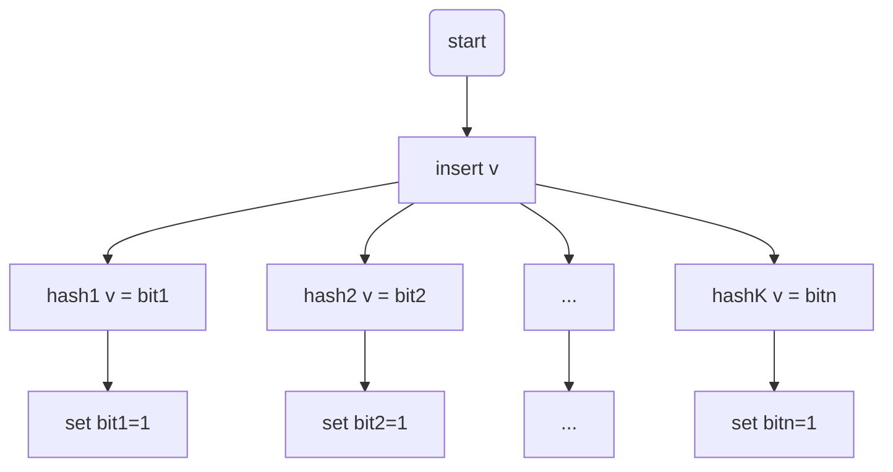
```mermaid
graph TB;
    0(start) --> 1;
    1[insert v] --> 2.1[hash1 v = bit1];
    1 --> 2.2[hash2 v = bit2];
    1 --> 2.3[...];
    1 --> 2.4[hashK v = bitn];
    2.1 --> 3.1[set bit1=1];
    2.2 --> 3.2[set bit2=1];
    2.3 --> 3.3[...];
    2.4 --> 3.4[set bitn=1];
```

# 操作系统
## 基本概念
### 进程与线程
#### 进程的特征
* **动态性**：进程是程序的一次执行过程，是临时的，有生命期的，是动态产生，动态消亡的。
* **并发性**：任何进程都可以同其他进行一起并发执行。
* **独立性**：进程是系统进行资源分配和调度的一个独立单位。
* **结构性**：进程由程序、数据、进程控制块三部分组成。

#### 进程与线程的区别
* 线程是程序执行的最小单位，而进程是操作系统分配资源的最小单位。
* 一个进程由一个或多个线程组成，线程是一个进程中代码的不同执行路线。
* 进程之间相互独立，但同一进程下的各个线程之间共享程序的内存空间及一些进程级资源（代码、数据、进程空间、打开文件等）。
* 线程的上下文切换比进程快得多。

### 用户态与内核态
#### intel x86 CPU特权级别
为了限制不同程序之间的访问能力，CPU按权限从高到低排序：RING0、RING1、RING2、RING3。\
其中，应用程序工作在RING3层，只能访问RING3层的数据。\
Windows、Linux操作系统工作在RING0、RING3层；在Linux中，RING0为内核态、RING3为用户态。

#### Unix和Linux操作系统体系结构
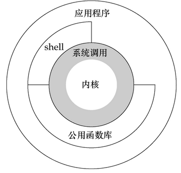
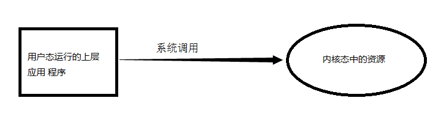

* **内核态**：控制计算机的硬件资源，并提供上层应用程序运行的环境。
* **用户态**：上层应用程序的活动空间，应用程序的执行必须依托于内核提供的资源。
* **系统调用**：为了使上层应用能够访问到这些资源，内核为上层应用提供访问的接口。系统调用是操作系统中最小的功能单位。

#### 用户态与内核态之间的转换
* **系统调用**：这是用户态进程主动要求切换到内核态的一种方式，用户态进程通过系统调用申请使用操作系统提供的服务程序完成工作。
* **异常**：当CPU执行用户态下的程序时，发生了某些事先不可知的异常，这时会触发由当前运行进程切换到处理此异常的内核相关程序中，也就转到了内核态，比如缺页异常。
* **外围设备中断**：当外围设备完成用户请求后，会向CPU发出相应的中断信号，这时CPU会暂停执行下一条即将要执行的指令转而去执行与中断信号对应的处理程序。

### 写时复制（copy on write）
复制对象时只引用原来的数据，直至真的要改动（写）才做一次复制。例如Linux系统中父进程创建子进程时，子进程与父进程共享同一片地址空间，直到子进程执行exec()（加载新的程序）时才将父进程的资源（代码、数据等）拷贝给子进程。\
这样做有利于减少内存开销。

### 僵尸进程
进程的生命周期如下图所示：
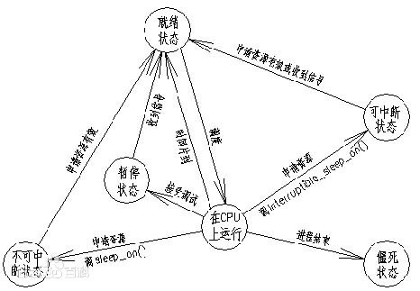

僵尸进程是当子进程比父进程先结束，而父进程又没有回收子进程，释放子进程占用的资源，此时子进程将成为一个僵尸进程。如果父进程先退出，子进程被init接管，此时子进程因为没有了父进程又被称作**孤儿进程**，子进程退出后init会回收其占用的相关资源。\
一个进程在调用exit命令结束自己的生命的时候，其实它并没有真正的被销毁，而是留下一个称为僵尸进程（Zombie）的数据结构（系统调用exit，它的作用是使进程退出，但也仅仅限于将一个正常的进程变成一个僵尸进程，并不能将其完全销毁）。

## Linux
### Linux进程地址空间布局
#### 进程布局
对于一个进程，其空间分布如下图所示：
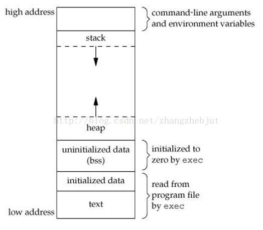

* **程序段(Text)**：程序代码在内存中的映射，存放函数体的二进制代码。
* **初始化过的数据(Data)**：在程序运行初已经对变量进行初始化的数据。
* **未初始化过的数据(BSS)**：在程序运行初未对变量进行初始化的数据。
* **栈(Stack)**：存储局部、临时变量，函数调用时，存储函数的返回指针，用于控制函数的调用和返回。在程序块开始时自动分配内存,结束时自动释放内存，其操作方式类似于数据结构中的栈。
* **堆(Heap)**：存储动态内存分配,需要程序员手工分配,手工释放.注意它与数据结构中的堆是两回事，分配方式类似于链表。

#### 内核空间与用户空间
以32位Linux系统为例，32位Linux的虚拟地址空间范围为0～4G，Linux内核将这4G字节的空间分为两部分，将最高的1G字节（从虚拟地址0xC0000000到0xFFFFFFFF）供内核使用，称为“内核空间”。而将较低的3G字节（从虚拟地址0x00000000到0xBFFFFFFF）供各个进程使用，称为“用户空间。因为每个进程可以通过系统调用进入内核，因此，Linux内核由系统内的所有进程共享。于是，从具体进程的角度来看，每个进程可以拥有4G字节的虚拟空间。

Linux使用两级保护机制：0级供内核使用，3级供用户程序使用，每个进程有各自的私有用户空间（0～3G），这个空间对系统中的其他进程是不可见的，最高的1GB字节虚拟内核空间则为所有进程以及内核所共享。

内核空间中存放的是内核代码和数据，而进程的用户空间中存放的是用户程序的代码和数据。不管是内核空间还是用户空间，它们都处于虚拟空间中。 虽然内核空间占据了每个虚拟空间中的最高1GB字节，但映射到物理内存却总是从最低地址（0x00000000），另外，使用虚拟地址可以很好的保护内核空间被用户空间破坏，虚拟地址到物理地址转换过程有操作系统和CPU共同完成(操作系统为CPU设置好页表，CPU通过MMU单元进行地址转换)。

### pthread
#### 用法
头文件\<pthread.h>\
gcc编译时要使用”-lpthread”标志。

#### pthread_create
用于创建线程

完整函数声明：
```c++
/**
 * @param tidp 线程ID
 * @param attr 线程属性，是一个结构体
 * @param start_rtn 线程所运行函数的起始地址
 * @param arg 线程运行函数的参数
 */
int pthread_create(pthread_t *tidp, const pthread_attr_t *attr, void *(*start_rtn)(void*), void *arg);
```
attr的定义如下：
```c++
typedef struct
{
    int                 detachstate;    线程的分离状态
    int                 schedpolicy;    线程调度策略
    struct sched_param  schedparam;     线程的调度参数
    int                 inheritsched;   线程的继承性
    int                 scope;          线程的作用域
    size_t              guardsize;      线程栈末尾的警戒缓冲区大小
    int                 stackaddr_set;
    void *              stackaddr;      线程栈的位置
    size_t              stacksize;      线程栈的大小
}pthread_attr_t;
```

#### pthread_join
以阻塞方式等待指定线程结束，并回收指定线程的资源。\
完整声明：
```c++
/**
 * @param thread 指定线程号
 * @param retval 指定线程所执行函数的返回值
 */
int pthread_join(pthread_t thread, void **retval);
```

#### pthread_detach
使主线程与子线程分离，子线程结束后，资源自动回收。\
完整声明：
```c++
/**
 * @param tid 分离的子线程号
 */
int pthread_detach(pthread_t tid);
```

### 进程/线程 绑定到CPU
将进程/线程绑定到CPU（核）可防止进程/线程在不同的CPU（核）间切换，导致私有cache利用率降低。\
#### Linux进程绑定系统调用
```c++
#include <sched.h>
/**
* 将进程pid绑定到CPU
* @param cpusetsize CPU mask的长度
* @param mask CPU mask
*/
int sched_setaffinity(pid_t pid, size_t cpusetsize, cpu_set_t *mask);

/**
* 获取进程pid所绑定的CPU掩码mask
* @param cpusetsize CPU mask的长度
* @param mask CPU mask
*/
int sched_getaffinity(pid_t pid, size_t cpusetsize, cpu_set_t *mask);
```
#### Linux线程绑定系统调用
```c++
#include <pthread.h>
/**
* 将线程thread绑定到计算核
* @param cpuset CPU亲和度
*/
int pthread_setaffinity_np(pthread_t thread, size_t cpusetsize, const cpu_set_t *cpuset);

/**
* 获取线程thread对应的CPU亲和度
* @param cpuset CPU亲和度
*/
int pthread_getaffinity_np(pthread_t thread, size_t cpusetsize, cpu_set_t *cpuset);
```

### 函数调用栈
程序的执行过程可看作连续的函数调用。当一个函数执行完毕时，程序要回到调用指令的下一条指令(紧接call指令)处继续执行。函数调用过程通常使用堆栈实现，每个用户态进程对应一个调用栈结构(call stack)。编译器使用堆栈传递函数参数、保存返回地址、临时保存寄存器原有值(即函数调用的上下文)以备恢复以及存储本地局部变量。

### make构建程序
#### make -j[num]
其中num表示并行编译作业的个数，例如make -j4同时进行4个作业。

# 计算机网络
## 基本概念
### TCP(Transmission Control Protocol, 传输控制协议)
#### 三次握手
以老板（client）叫我（server）去拿快递为例。
1. **客户端建立连接**：老板：“那个谁谁谁，你去帮我拿一下快递”。老板发送请求报文，同步位SYN=1，同时随机生成初始序列号seq=x。
2. **服务端应答**：我：“老板你在叫我吗？”。我如果愿意帮老板拿快递，就发出确认报文，同时等待老板的回复，应答位ACK=1，同步位SYN=1，确认号是ack=x+1，同时为自己随机初始化一个序列号seq=y。
3. **客户端确认连接**：老板：“对就是你”。老板发送确认报文，我确认老板叫我去拿快递，ACK=1，ack=y+1，此时连接建立。

##### 为什么握手次数是3次
若握手次数为2，服务端会在客户端发送一次请求后认为连接已建立，但这时若服务端的应答报文没能立即到达客户端，可能就被丢掉，客户端是不知道连接已建立的，这会浪费服务端的资源。若握手次数为4，比3次握手消耗更多资源，且连接可靠性没有明显提升。

#### 四次挥手
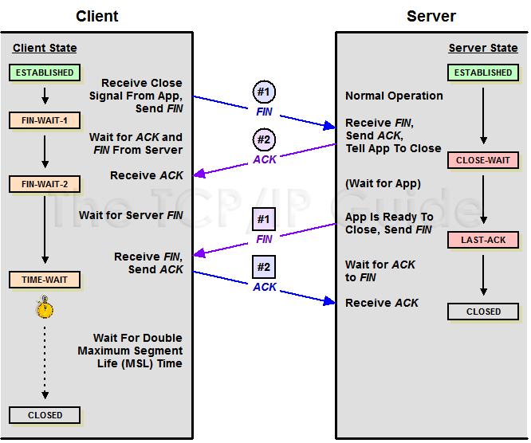\
挥手过程：
1. 客户端发送一个FIN，用来关闭客户端到服务器的数据传送。
2. 服务器收到这个FIN，它发回一个ACK，确认序号为收到的序号为FIN序号加1。和SYN一样，一个FIN将占用一个序号。
3. 服务器关闭与客户端的连接，发送一个FIN给客户端。
4. 客户端发回ACK报文确认，并将确认序号设置为收到序号加1。

##### 为什么挥手是4次
关闭连接时，当收到对方的FIN报文通知时，它仅仅表示对方没有数据发送给你了；但未必你所有的数据都全部发送给对方了，所以你未必会马上会关闭SOCKET,也即你可能还需要发送一些数据给对方之后，再发送FIN报文给对方来表示你同意可以关闭连接了，所以它这里的ACK报文和FIN报文多数情况下都是分开发送的。

#### 半连接队列（sync queue）与全连接队列（accept queue）
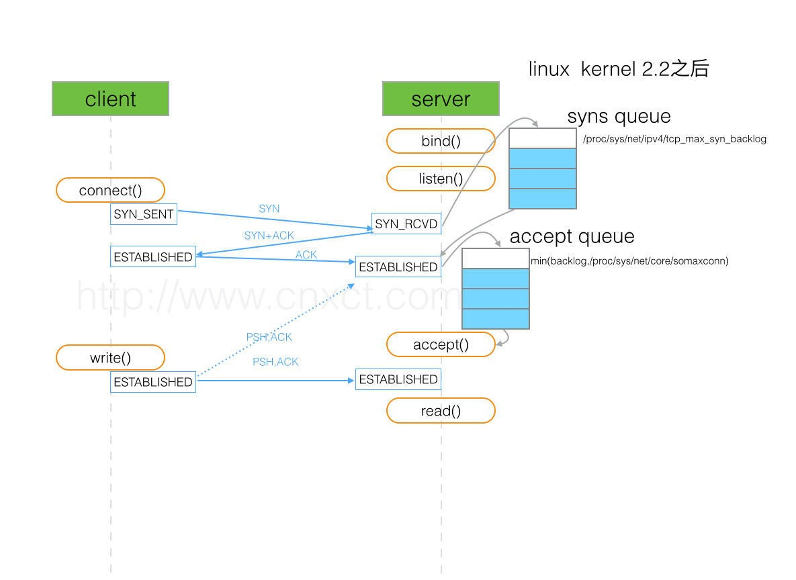

##### server端的半连接队列(syn队列)
在三次握手协议中，服务器维护一个半连接队列，该队列为每个客户端的SYN包开设一个条目(服务端在接收到SYN包的时候，就已经创建了request_sock结构，存储在半连接队列中)，该条目表明服务器已收到SYN包，并向客户发出确认，正在等待客户的确认包（会进行第二次握手发送SYN＋ACK 的包加以确认）。这些条目所标识的连接在服务器处于Syn_RECV状态，当服务器收到客户的确认包时，删除该条目，服务器进入ESTABLISHED状态。\
该队列为SYN 队列，长度为 max(64, /proc/sys/net/ipv4/tcp_max_syn_backlog) ，在机器的tcp_max_syn_backlog值在/proc/sys/net/ipv4/tcp_max_syn_backlog下配置。

##### server端的完全连接队列(accpet队列)
当第三次握手时，当server接收到ACK 报之后， 会进入一个新的叫 accept 的队列，该队列的长度为 min(backlog, somaxconn)，默认情况下，somaxconn 的值为 128，表示最多有 129 的 ESTAB 的连接等待 accept()，而 backlog 的值则应该是由 int listen(int sockfd, int backlog) 中的第二个参数指定，listen 里面的 backlog 可以有我们的应用程序去定义的。

### UDP（User Datagram Protocol, 用户数据报协议）
#### 为什么说UDP不可靠
* 不保证消息交付：不确认，不重传，无超时。
* 不保证交付顺序：不设置包序号，不重排，不会发生队首阻塞。
* 不跟踪连接状态： 不必建立连接或重启状态机。
* 不需要拥塞控制： 不内置客户端或网络反馈机制。

#### UDP通讯模型
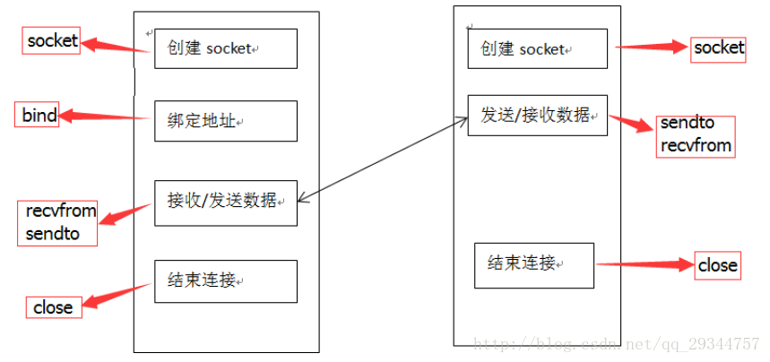

##### connect()函数
udp客户端建立了socket后可以直接调用sendto()函数向服务器发送数据，但是需要在sendto()函数的参数中指定目的地址/端口，但是可以调用connect()函数先指明目的地址/端口，然后就可以使用send()函数向目的地址发送数据了，因为此时套接字已经包含目的地址/端口，也就是send()函数已经知道包含目的地址/端口。

##### bind()函数
udp服务器调用了bind()函数为服务器套接字绑定本地地址/端口，这样使得客户端的能知道它发数据的目的地址/端口，服务器如果单单接收客户端的数据，或者先接收客户端的数据(此时通过recvfrom()函数获取到了客户端的地址信息/端口)再发送数据，客户端的套接字可以不绑定自身的地址/端口，因为udp在创建套接字后直接使用sendto()，隐含操作是，在发送数据之前操作系统会为该套接字随机分配一个合适的udp端口，将该套接字和本地地址信息绑定。\
但是，如果服务器程序就绪后一上来就要发送数据给客户端，那么服务器就需要知道客户端的地址信息和端口，那么就不能让客户端的地址信息和端口号由客户端所在操作系统分配，而是要在客户端程序指定了。怎么指定，那就是用bind()函数。\
如上所述，connect()函数可以用来指明套接字的目的地址/端口号，那么若udp服务器可以使用connect，将导致服务器只接受这特定一个主机的请求。

### 五种IO模型
#### 阻塞IO
A拿着一支鱼竿在河边钓鱼，并且一直在鱼竿前等，在等的时候不做其他的事情，十分专心。只有鱼上钩的时，才结束掉等的动作，把鱼钓上来。\
客户一直等待内核准备好数据，即文件描述符就绪，才进行下一步。
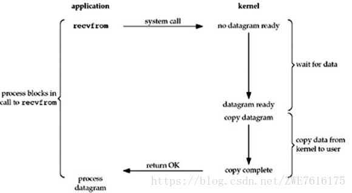

#### 非阻塞IO
B也在河边钓鱼，但是B不想将自己的所有时间都花费在钓鱼上，在等鱼上钩这个时间段中，B也在做其他的事情（一会看看书，一会读读报纸，一会又去看其他人的钓鱼等），但B在做这些事情的时候，每隔一个固定的时间检查鱼是否上钩。一旦检查到有鱼上钩，就停下手中的事情，把鱼钓上来。\
每次客户询问内核是否有数据准备好，即文件描述符缓冲区是否就绪。当有数据报准备好时，就进行拷贝数据报的操作。当没有数据报准备好时，也不阻塞程序，内核直接返回未准备就绪的信号，等待用户程序的下一个**轮寻**。\
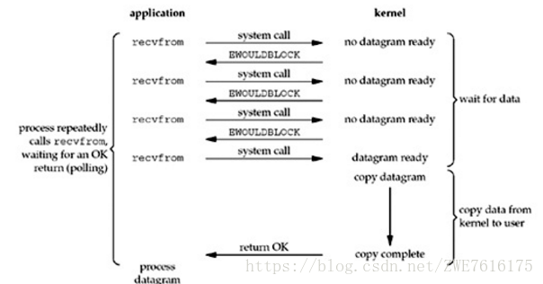\
但是，轮寻对于CPU来说是较大的浪费，一般只有在特定的场景下才使用。

#### 信号驱动IO
C也在河边钓鱼，但与A、B不同的是，C比较聪明，他给鱼竿上挂一个铃铛，当有鱼上钩的时候，这个铃铛就会被碰响，C就会将鱼钓上来。\
信号驱动IO模型，应用进程告诉内核：当数据报准备好的时候，给我发送一个信号，对SIGIO信号进行捕捉，并且调用我的信号处理函数来获取数据报。\
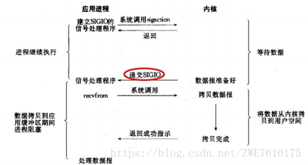

#### IO多路转接
D同样也在河边钓鱼，但是D生活水平比较好，D拿了很多的鱼竿，一次性有很多鱼竿在等，D不断的查看每个鱼竿是否有鱼上钩。增加了效率，减少了等待的时间。\
IO多路转接是多了一个select函数，select函数有一个参数是文件描述符集合，对这些文件描述符进行循环监听，当某个文件描述符就绪时，就对这个文件描述符进行处理。\
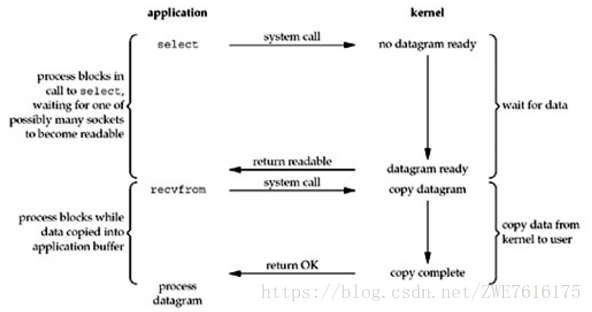

#### 异步IO
前4个IO可统称为同步IO。\
E也想钓鱼，但E有事情，于是他雇来了F，让F帮他等待鱼上钩，一旦有鱼上钩，F就打电话给E，E就会将鱼钓上去。\
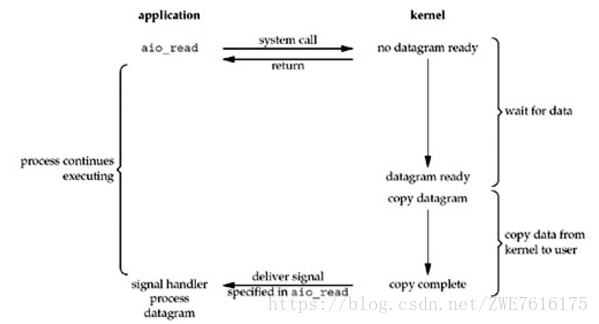\
当应用程序调用aio_read时，内核一方面去取数据报内容返回，另一方面将程序控制权还给应用进程，应用进程继续处理其他事情，是一种非阻塞的状态。\
当内核中有数据报就绪时，由内核将数据报拷贝到应用程序中，返回aio_read中定义好的函数处理程序。

### IO多路复用（multiplexing）
下面举一个例子，模拟一个tcp服务器处理30个客户socket。\
假设你是一个老师，让30个学生解答一道题目，然后检查学生做的是否正确，你有下面几个选择：
* 第一种选择：按顺序逐个检查，先检查A，然后是B，之后是C、D。。。这中间如果有一个学生卡住，全班都会被耽误。
这种模式就好比，你用循环挨个处理socket，根本不具有并发能力。
* 第二种选择：你创建30个分身，每个分身检查一个学生的答案是否正确。 这种类似于为每一个用户创建一个进程或者线程处理连接。
* 第三种选择，你站在讲台上等，谁解答完谁举手。这时C、D举手，表示他们解答问题完毕，你下去依次检查C、D的答案，然后继续回到讲台上等。此时E、A又举手，然后去处理E和A。

这种就是**IO复用模型**，Linux下的select、poll和epoll就是干这个的。将用户socket对应的fd（文件描述符）注册进epoll，然后epoll帮你监听哪些socket上有消息到达，这样就避免了大量的无用操作。此时的socket应该采用非阻塞模式。
这样，整个过程只在调用select、poll、epoll这些调用的时候才会阻塞，收发客户消息是不会阻塞的，整个进程或者线程就被充分利用起来，这就是事件驱动，所谓的reactor模式。

#### IO多路复用中select和epoll的区别
##### 支持一个进程所能打开的最大连接数
* **select**：单个进程所能打开的最大连接数有FD_SETSIZE宏定义，其大小是32个整数的大小（在32位的机器上，大小就是32\*32，同理64位机器上FD_SETSIZE为32\*64），当然我们可以对进行修改，然后重新编译内核，但是性能可能会受到影响，这需要进一步的测试。
* **epoll**：虽然连接数有上限，但是很大，1G内存的机器上可以打开10万左右的连接，2G内存的机器可以打开20万左右的连接。

##### FD（文件描述符）剧增后带来的IO效率问题
* **select**：因为每次调用时都会对连接进行线性遍历，所以随着FD的增加会造成遍历速度慢的“线性下降性能问题”。
* **epoll**：因为epoll内核中实现是根据每个fd上的callback函数来实现的，只有活跃的socket才会主动调用callback，所以在活跃socket较少的情况下，使用epoll没有前面两者的线性下降的性能问题，但是所有socket都很活跃的情况下，可能会有性能问题。

##### 消息传递方式
* **select**：内核需要将消息传递到用户空间，都需要内核拷贝动作。
* **epoll**：epoll通过内核和用户空间共享一块内存来实现的。

### NAT(网络地址转换)
#### 概念
在局域网和因特网之间进行地址转换，私有IP与公共IP间转换。

#### 功能
* 解决IPv4地址不足的问题。
* 有效地避免来自网络外部的攻击。

#### 实现方式
* **静态转换**：是指将内部网络的私有IP地址转换为公有IP地址，IP地址对是一对一的，是一成不变的，某个私有IP地址只转换为某个公有IP地址。借助于静态转换，可以实现外部网络对内部网络中某些特定设备（如服务器）的访问。
* **动态转换**：是指将内部网络的私有IP地址转换为公用IP地址时，IP地址是不确定的，是随机的，所有被授权访问上Internet的私有IP地址可随机转换为任何指定的合法IP地址。也就是说，只要指定哪些内部地址可以进行转换，以及用哪些合法地址作为外部地址时，就可以进行动态转换。动态转换可以使用多个合法外部地址集。当ISP提供的合法IP地址略少于网络内部的计算机数量时。可以采用动态转换的方式。
* **端口多路复用（Port address Translation, PAT）**：是指改变外出数据包的源端口并进行端口转换，即端口地址转换（PAT，Port Address Translation).采用端口多路复用方式。内部网络的所有主机均可共享一个合法外部IP地址实现对Internet的访问，从而可以最大限度地节约IP地址资源。同时，又可隐藏网络内部的所有主机，有效避免来自internet的攻击。因此，目前网络中应用最多的就是端口多路复用方式。
* **ALG(Application Level Gateway)**：即应用程序级网关技术：传统的NAT技术只对IP层和传输层头部进行转换处理，但是一些应用层协议，在协议数据报文中包含了地址信息。为了使得这些应用也能透明地完成NAT转换，NAT使用一种称作ALG的技术，它能对这些应用程序在通信时所包含的地址信息也进行相应的NAT转换。例如：对于FTP协议的PORT/PASV命令、DNS协议的 "A" 和 "PTR" queries命令和部分ICMP消息类型等都需要相应的ALG来支持。

### HTTP协议
#### 标准方法
链接：https://www.nowcoder.com/questionTerminal/e2ce5730704246609efca03285532c50?orderByHotValue=1&page=1&onlyReference=false
来源：牛客网

HTTP/1.1协议定义了八种方法(动作)来表明Request-URI指定的资源的不同操作方式：
- OPTIONS - 返回服务器针对特定资源所支持的HTTP请求方法。也可以利用向Web服务器发送'*'的请求来测试服务器的功能性 
- HEAD - 向服务器索要与GET请求相一致的响应，只不过响应体将不会被返回。这一方法可以在不必传输整个响应内容的情况下，就可以获取包含在响应消息头中的元信息
- GET - 向特定的资源发出请求。注意：GET方法不应当被用于产生“副作用”的操作中，例如在web app.中。其中一个原因是GET可能会被网络蜘蛛等随意访问
- POST - 向指定资源提交数据进行处理请求（例如提交表单或者上传文件）。数据被包含在请求体中。POST请求可能会导致新的资源的建立和/或已有资源的修改
- PUT - 向指定资源位置上传其最新内容
- DELETE - 请求服务器删除Request-URI所标识的资源
- TRACE - 回显服务器收到的请求，主要用于测试或诊断
- CONNECT - HTTP/1.1协议中预留给能够将连接改为管道方式的服务器

# 数据库
## 基本概念
### 数据库中三大范式
* **第一范式（1NF）**：要求数据库表的每一列都是不可分割的原子项数据。如数据库表中的所有字段值都是不可分解的原子值。
* **第二范式（2NF）**：在1NF的基础上，需要确保数据库表中的每一列都和主键相关，而不能只与主键的某一部分相关（主要针对联合主键）。也就是说在一个数据库表中，一个表中只能保存一种数据，不可以把多种数据保存在同一张数据表中。
* **第三范式（3NF）**：在2NF基础上，需要确保数据表中的每一列数据都和主键直接相关，不能间接相关。

### 事务
事务主要用于处理操作量大、复杂度高的数据。\
事务必须满足4个条件（ACID）：原子性、一致性、隔离性、持久性。
* **原子性**：一个事务中的所有操作，要么全部完成，要么全部不完成，不会结束在中间某个环节。事务在执行过程中发生错误，会被回滚到事务开始前的状态，就像这个事务从来没有执行过一样。
* **一致性**：在事务开始之前和事务结束以后，数据库的完整性没有被破坏。这表示写入的资料必须完全符合所有的预设规则，这包含资料的精确度、串联性以及后续数据库可以自发性地完成预定的工作。
* **隔离性**：数据库允许多个并发事务同时对其数据进行读写和修改的能力，隔离性可以防止多个事务并行执行时由于交叉执行而导致数据的不一致。事务隔离分为不同级别，包括 读未提交、读提交、可重复读、串行化。
* **持久性**：事务处理结束后，对数据的修改是永久的，即使系统故障也不会丢失。

# 编译原理
## 前端（frontend）
前端的流程：
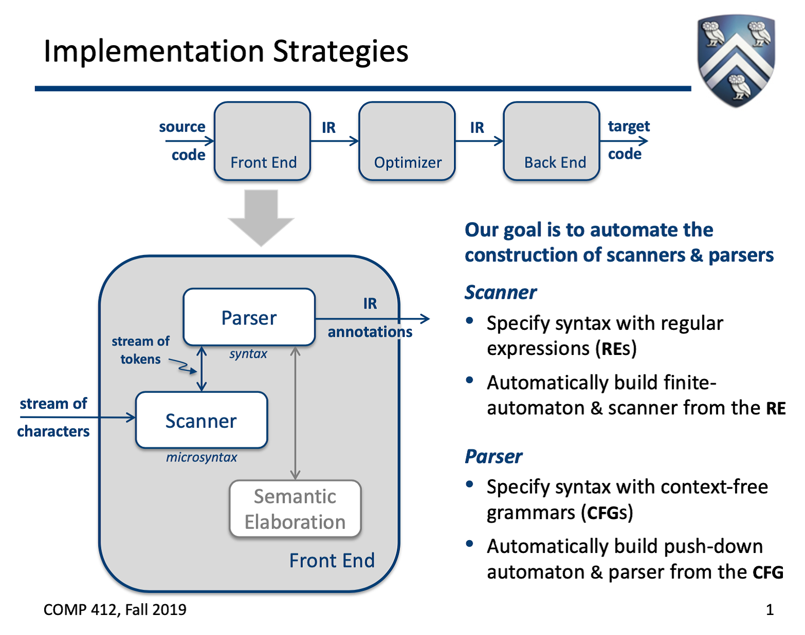

### 词法分析（lexer, scanner）
#### 有限自动机（finite automaton, FA）
##### 非确定有限自动机（nondeterministic finite automaton, NFA）
非确定有限状态自动机或非确定有限自动机（NFA）是对每个状态和输入符号对可以有多个可能的下一个状态的有限状态自动机。\
一般需要将NFA进一步转换成FA才能在词法分析中投入应用。

##### 确定有限自动机（deterministic finite automaton, FA）
确定有限状态自动机或确定有限自动机是一个能实现状态转移的自动机。对于一个给定的属于该自动机的状态和一个属于该自动机字母表求和的字符，它都能根据事先给定的转移函数转移到下一个状态（这个状态可以是先前那个状态）。\
为了减小词法分析的复杂度，一般还需要将FA进一步化简成minimal FA。

#### 词法分析流程
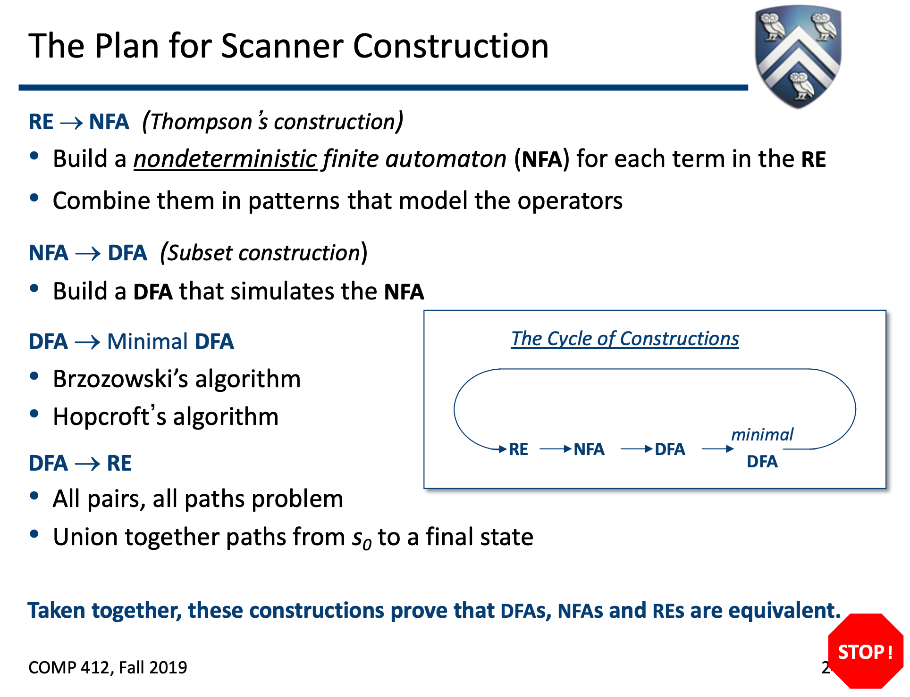

### PL/0语言

### 巴斯科范式（BNF）
一种形式化的语法表示方法，用来描述语法的一种形式体系，是一种典型的元语言。\
规则：
* 在双引号中的字("word")代表着这些字符本身。而double_quote用来代表双引号。
* 在双引号外的字（有可能有下划线）代表着语法部分。
* 尖括号( < > )内包含的为必选项。
* 方括号( [ ] )内包含的为可选项。
* 大括号( { } )内包含的为可重复0至无数次的项。
* 竖线( | )表示在其左右两边任选一项，相当于"OR"的意思。
* ::= 是“被定义为”的意思。

## 文法
### 0型文法
这是最简单的一个文法。它比较宽容，没有那么多的限制条件。左边必须要包含这些元素或者元素组合中的至少一个非终结符，右边可以是这些元素的任意组合，这样就构成了 0 型文法。由于限制最少，所以见到的文法至少是一个 0 型文法。 、
例如：
```
A—> a
```

### 1型文法（上下文有关文法）
它在 0 型文法的基础之上，只添加了一个要求：右边的长度 >= 左边的长度（终结符或非终结符的个数）。
```
A—> a、B—>dba # 则是 1 型文法，而adB—>d不符合 1 型文法要求
```
注意这里有一个特殊的形式 S—> ∑（∑表示空），也是一个 1 型文法。

### 2型文法（上下文无关文法）
它在 1 型文法的基础上，有增加了一个要求：左边必须是非终结符（个数不限）。\
例如：
```
AB—>de # 属于2型文法，而 Aa—>DE则不是，因为Aa中含有a。
```

### 3型文法（正规文法）
它是在 2 型的基础上提出了要么一个非终结符推出一个终结符，要么一个非终结符推出一个终结符并且带一个非终结符。
```
A—>a | aB (右线性) 、 A—> a | Ba (左线性)
```
而上图中的左线性、右线性是相互独立的。如：A—>b、A—>bD 这是 3 型文法 
但是A—>b、A—>bD、A—>Db则不是3型文法。从这里可以看出，对于 3 型文法，它不是左右线性的“组合”，要么都是右线性，要么都是左线性。

## 上下文无关文法
### 定义
文法中所有的**产生式**左边只有一个非终结符，比如：
```
S -> aSb
S -> ab
```
这个文法有两个产生式，每个产生式左边只有一个非终结符S，这就是上下文无关文法，因为你只要找到符合产生式右边的串，就可以把它归约为对应的非终结符。

比如：
```
aSb -> aaSbb
S -> ab
```
这就是上下文相关文法，因为它的第一个产生式左边有不止一个符号，所以你在匹配这个产生式中的S的时候必需确保这个S有正确的“上下文”，也就是左边的a和右边的b，所以叫上下文相关文法。

### LL(k)文法，自顶向下文法

### LR(k)文法，自底向下文法

## LLVM
### 静态单赋值形式（Static Single Assignment form, SSA form）
SSA 形式的 IR 主要特征是每个变量只赋值一次。相比而言，非 SSA 形式的 IR 里一个变量可以赋值多次。为了得到 SSA 形式的 IR，起初的 IR 中的变量会被分割成不同的版本（version），每个定义（definition：静态分析术语，可以理解为赋值）对应着一个版本。在教科书中，通常会在旧的变量名后加上下标构成新的变量名，这也就是各个版本的名字。显然，在 SSA 形式中，UD 链（Use-Define Chain）是十分明确的。也就是说，变量的每一个使用（use：静态分析术语，可以理解为变量的读取）点只有唯一一个定义可以到达。

### IR(Intermediate Representation)
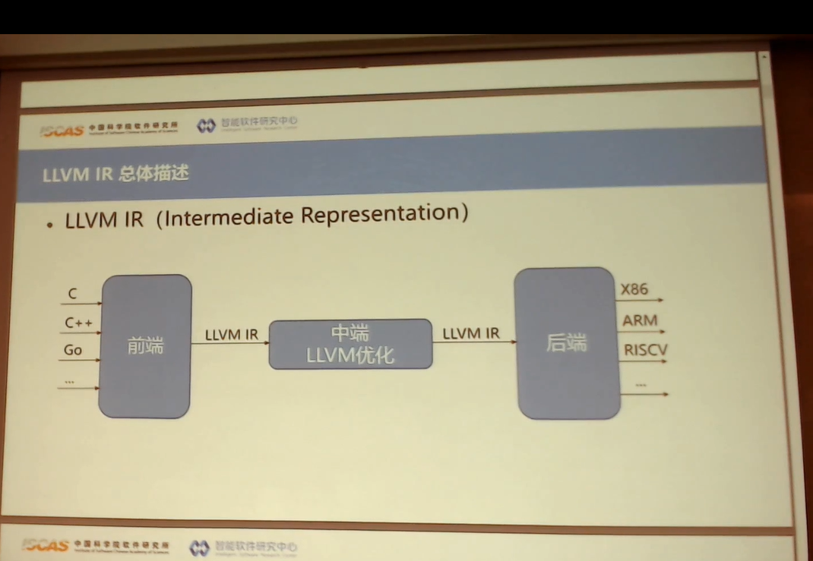

#### IR的特征
* 采用SSA形式+无限寄存器：（1）每个变量都只被赋值一次；（2）容易确定操作间的依赖关系，便于优化分析。
* 采用3地址的方式：例如 %2 = add i32 %0, %1。
* 强类型系统，每个Value都具备自身的类型。

#### IR程序构成
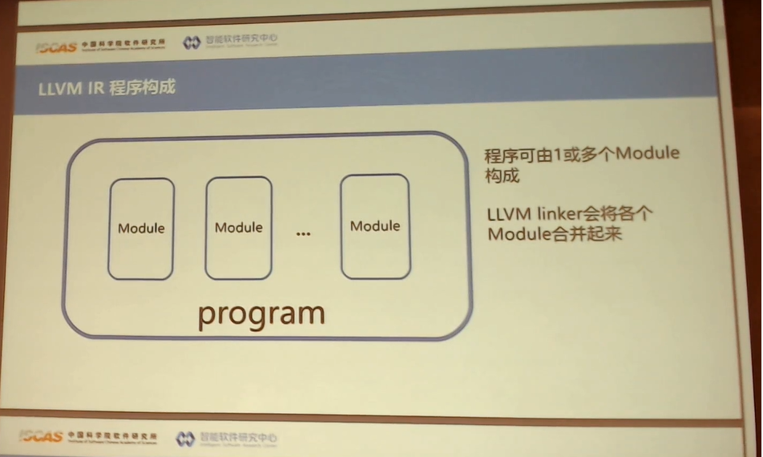

#### LLVM Module
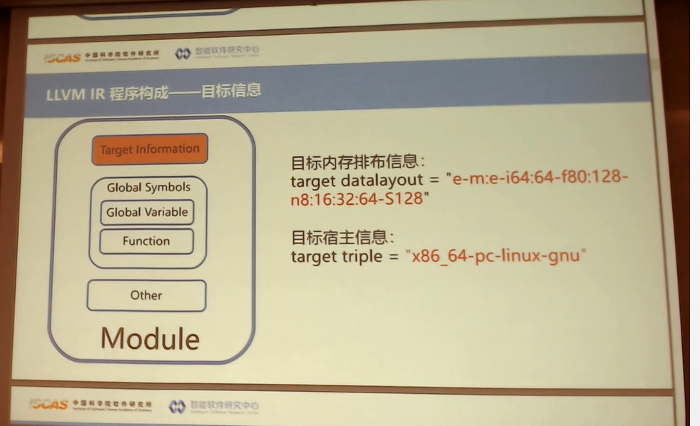\
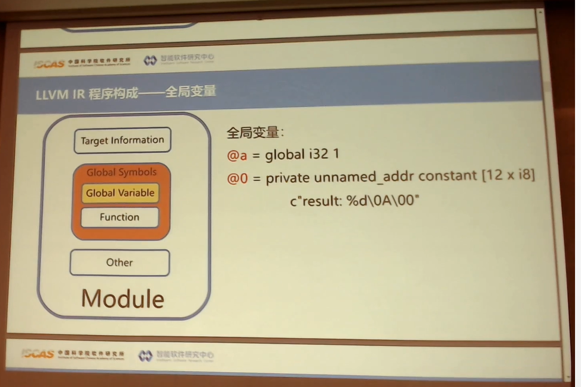\
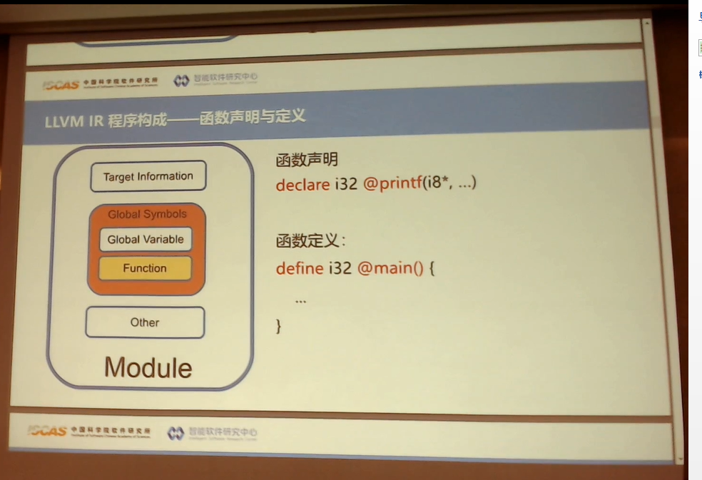

#### LLVM Function
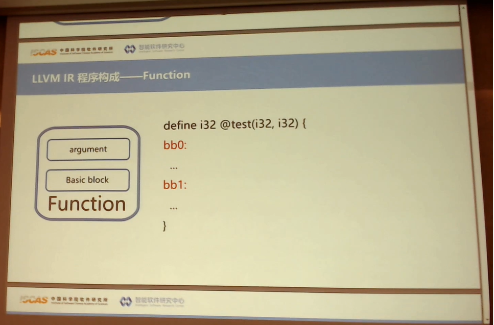

#### LLVM BasicBlock
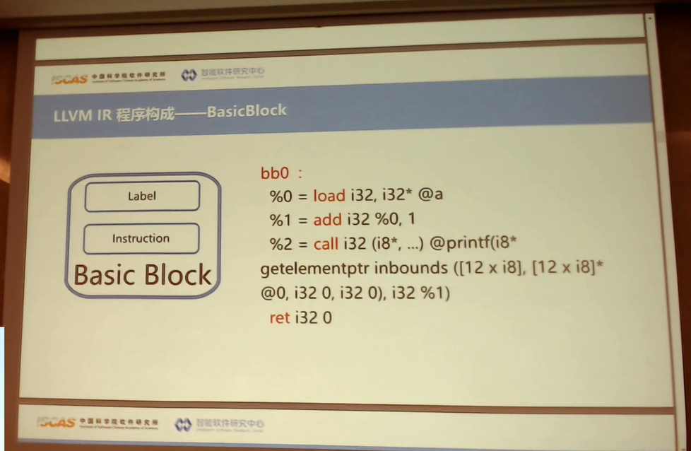

#### LLVM Instruction
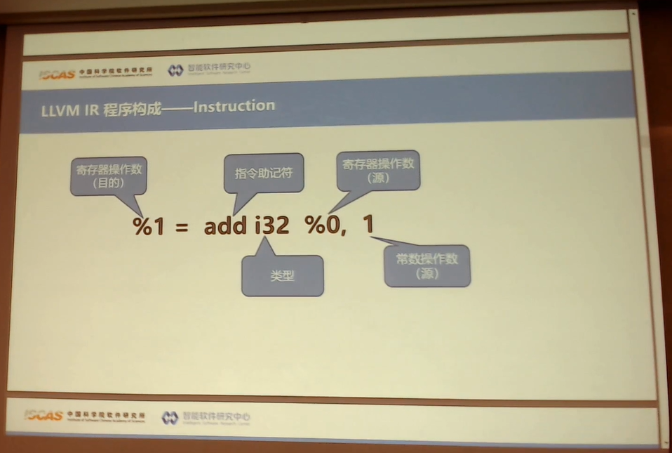

# 软件工程
## 设计模式（Design Pattern）
### 四人帮（Gang of Four, GOF）
在 1994 年，由 Erich Gamma、Richard Helm、Ralph Johnson 和 John Vlissides 四人合著出版了一本名为 Design Patterns - Elements of Reusable Object-Oriented Software（中文译名：设计模式 - 可复用的面向对象软件元素） 的书，该书首次提到了软件开发中设计模式的概念。\
GOF提出的面向对象设计原则
* 对接口编程而不是对实现编程
* 优先使用对象组合而不是继承

### 设计模式的类型
#### 创建型模式
这些设计模式提供了一种在创建对象的同时隐藏创建逻辑的方式，而不是使用 new 运算符直接实例化对象。这使得程序在判断针对某个给定实例需要创建哪些对象时更加灵活。包括：
* 工厂模式（Factory Pattern）
* 抽象工厂模式（Abstract Factory Pattern）
* 单例模式（Singleton Pattern）
* 建造者模式（Builder Pattern）
* 原型模式（Prototype Pattern）

#### 结构型模式
这些设计模式关注类和对象的组合。继承的概念被用来组合接口和定义组合对象获得新功能的方式。包括：
* 适配器模式（Adapter Pattern）
* 桥接模式（Bridge Pattern）
* 过滤器模式（Filter、Criteria Pattern）
* 组合模式（Composite Pattern）
* 装饰器模式（Decorator Pattern）
* 外观模式（Facade Pattern）
* 享元模式（Flyweight Pattern）
* 代理模式（Proxy Pattern）

#### 行为型模式
这些设计模式特别关注对象之间的通信。包括：
* 责任链模式（Chain of Responsibility Pattern）
* 命令模式（Command Pattern）
* 解释器模式（Interpreter Pattern）
* 迭代器模式（Iterator Pattern）
* 中介者模式（Mediator Pattern）
* 备忘录模式（Memento Pattern）
* 观察者模式（Observer Pattern）
* 状态模式（State Pattern）
* 空对象模式（Null Object Pattern）
* 策略模式（Strategy Pattern）
* 模板模式（Template Pattern）
* 访问者模式（Visitor Pattern）

#### J2EE模式
这些设计模式特别关注表示层。这些模式是由 Sun Java Center 鉴定的。包括：
* MVC模式（MVC Pattern）
* 业务代表模式（Business Delegate Pattern）
* 组合实体模式（Composite Entity Pattern）
* 数据访问对象模式（Data Access Object Pattern）
* 前端控制器模式（Front Controller Pattern）
* 拦截过滤器模式（Intercepting Filter Pattern）
* 服务定位器模式（Service Locator Pattern）
* 传输对象模式（Transfer Object Pattern）


### 设计模式的六大原则
#### 开闭原则（Open Close Principle）
开闭原则的意思是：对扩展开放，对修改关闭。在程序需要进行拓展的时候，不能去修改原有的代码，实现一个热插拔的效果。简言之，是为了使程序的扩展性好，易于维护和升级。想要达到这样的效果，我们需要使用接口和抽象类，后面的具体设计中我们会提到这点。

#### 里氏代换原则（Liskov Substitution Principle）
里氏代换原则是面向对象设计的基本原则之一。里氏代换原则中说，任何基类可以出现的地方，子类一定可以出现。LSP是继承复用的基石，只有当派生类可以替换掉基类，且软件单位的功能不受到影响时，基类才能真正被复用，而派生类也能够在基类的基础上增加新的行为。里氏代换原则是对开闭原则的补充。实现开闭原则的关键步骤就是抽象化，而基类与子类的继承关系就是抽象化的具体实现，所以里氏代换原则是对实现抽象化的具体步骤的规范。

#### 依赖倒转原则（Dependence Inversion Principle）
这个原则是开闭原则的基础，具体内容：针对接口编程，依赖于抽象而不依赖于具体。

#### 接口隔离原则（Interface Segregation Principle）
这个原则的意思是：使用多个隔离的接口，比使用单个接口要好。它还有另外一个意思是：降低类之间的耦合度。由此可见，其实设计模式就是从大型软件架构出发、便于升级和维护的软件设计思想，它强调降低依赖，降低耦合。

#### 迪米特法则，又称最少知道原则（Demeter Principle）
最少知道原则是指：一个实体应当尽量少地与其他实体之间发生相互作用，使得系统功能模块相对独立。

#### 合成复用原则（Composite Reuse Principle）
合成复用原则是指：尽量使用合成/聚合的方式，而不是使用继承。

## 单例
单例模式（Singleton Pattern）是 Java 中最简单的设计模式之一。这种类型的设计模式属于创建型模式，它提供了一种创建对象的最佳方式。这种模式涉及到一个单一的类，该类负责创建自己的对象，同时确保只有单个对象被创建。这个类提供了一种访问其唯一的对象的方式，可以直接访问，不需要实例化该类的对象。\
示例（Java）：
1. 创建一个 Singleton 类。
```java
public class SingleObject {
 
   //创建 SingleObject 的一个对象
   private static SingleObject instance = new SingleObject();
 
   //让构造函数为 private，这样该类就不会被实例化
   private SingleObject(){}
 
   //获取唯一可用的对象
   public static SingleObject getInstance(){
      return instance;
   }
 
   public void showMessage(){
      System.out.println("Hello World!");
   }
}
```
2. 从 singleton 类获取唯一的对象。
```java
public class SingletonPatternDemo {
   public static void main(String[] args) {
 
      //不合法的构造函数
      //编译时错误：构造函数 SingleObject() 是不可见的
      //SingleObject object = new SingleObject();
 
      //获取唯一可用的对象
      SingleObject object = SingleObject.getInstance();
 
      //显示消息
      object.showMessage();
   }
}
```
3. 执行程序，输出结果：
```
Hello World!
```

# 测试开发
## 白盒、黑盒测试
### 白盒测试
#### 定义
白盒测试又称**结构测试**、**透明盒测试**、**逻辑驱动测试**或**基于代码的测试**。白盒测试是一种测试用例设计方法，盒子指的是被测试的软件，白盒指的是盒子是可视的，即清楚盒子内部的东西以及里面是如何运作的。"白盒"法全面了解程序内部逻辑结构、对所有逻辑路径进行测试。"白盒"法是穷举路径测试。在使用这一方案时，测试者必须检查程序的内部结构，从检查程序的逻辑着手，得出测试数据。贯穿程序的独立路径数是天文数字。\
白盒测试的测试方法有**代码检查法**、**静态结构分析法**、**静态质量度量法**、**逻辑覆盖法**、**基本路径测试法**、**域测试**、**符号测试**、**路径覆盖**和**程序变异**。

#### 覆盖标准
白盒测试法的覆盖标准有**逻辑覆盖**、**循环覆盖**和**基本路径测试**。其中逻辑覆盖包括语句覆盖、判定覆盖、条件覆盖、判定/条件覆盖、条件组合覆盖和路径覆盖。六种覆盖标准发现错误的能力呈由弱到强的变化：
1. 语句覆盖：每条语句至少执行一次。
2. 判定覆盖：每个判定的每个分支至少执行一次。
3. 条件覆盖：每个判定的每个条件应取到各种可能的值。
4. 判定/条件覆盖：同时满足判定覆盖和条件覆盖。
5. 条件组合覆盖：每个判定中个条件的每一种组合至少出现一次。
6. 路径覆盖：使程序中每一条可能的路径至少执行一次。

#### 目的
通过检查软件内部的逻辑结构，对软件中的逻辑路径进行覆盖测试。在程序不同地方设立检查点，检查程序的状态，以确定实际运行状态与预期状态是否一致。

#### 原则
1. 一个模块中所有独立路径至少被测试一次。
2. 所有逻辑值均需测试true和false两种情况。
3. 检查程序的内部数据结构，保证其结构的有效性。
4. 在取值的上、下边界及可操作范围内运行所有循环。

#### 实施阶段
1. **测试计划阶段**：根据需求说明书，制定测试进度。
2. **测试设计阶段**：依据程序设计说明书，按照一定规范化的方法进行软件结构划分和设计测试用例。
3. **测试执行阶段**：输入测试用例，得到测试结果。
4. **测试总结阶段**：对比测试的结果和代码的预期结果，分析错误原因，找到并解决错误。

#### 分类
* **静态分析**：不通过执行程序而进行测试的技术。静态分析的关键功能是检查软件的表示和描述是否一致，有无冲突或者歧义。
* **动态分析**：当软件系统在模拟的或真实的环境中执行之前、之中和之后，对软件系统行为的分析。动态分析包含了程序在受控的环境下使用特定的期望结果进行正式的运行。它显示了一个系统在检查状态下是正确还是不正确。在动态分析技术中，最重要的技术是路径和分支测试。

### 黑盒测试
#### 定义
又叫**功能测试**，通过测试来检测每个功能是否都能正常使用。在测试中，把程序看作一个不能打开的黑盒子，在完全不考虑程序内部结构和内部特性的情况下，在程序接口进行测试，它只检查程序功能是否按照需求规格说明书的规定正常使用，程序是否能适当地接收输入数据而产生正确的输出信息。黑盒测试着眼于程序外部结构，不考虑内部逻辑结构，主要针对软件界面和软件功能进行测试。

#### 作用
黑盒测试方法着重测试软件的功能需求，是在程序接口上进行的测试，主要是为了发现以下错误：
* 是否有功能错误，是否有功能遗漏。
* 是否能够正确地接收输入数据并产生正确的输出结果。
* 是否有数据结构错误或外部信息访问错误。
* 是否有陈谷初始化和终止方面的错误。

#### 测试内容
##### 接受性测试
黑盒测试是从软件的接口接受测试输出结果，具有接受性测试的特点。

##### $\alpha/\beta$测试
普通测试是项目组内的成员对被测软件进行的测试，$\alpha/\beta$测试是由项目组外的人员参加的测试。也就是说，当测试发现错误后在开发人员修改的同时，项目经理也会对产品计划作出相应的调整，产品特征不断地被修改。

##### 菜单/帮助测试
在软件测试的过程中，开发人员将修复测试人员发现的错误，而且对软件的有些功能进行修改，同时项目经理也将根据情况调整软件的特性，因而在软件开发和测试的过程中，所有的功能都可以进行调整。因此，在软件产品开发的最后阶段，文档里发现的问题往往最多。

##### 发行测试
在正式发行前，产品要经过非常仔细的测试。除了专门的测试人员外，还需要几千个甚至几十万其他用户与合作者通过使用来对产品进行测试。然后将错误信息反馈到技术部门。到发行测试时，如果出现非改不可的错误，就必须推迟软件的发行，在推迟时间内需要重新对软件产品进行全面的测试，将耗费大量的时间、人力和物力。

##### 回归测试
在此阶段，首先要检查以前找到的错误是否已经更正了。回归测试可使已更正的错误不再重现，并且不会产生新的错误。

##### RTM测试
RTM测试是指在产品**发行阶段**所进行的测试。在这一测试阶段，每一个错误都需要经过高端人员统一才能更正。因为这时候修改软件非常容易产生其他的错误，所以只有那种非修复不可的错误才将允许进行修改。如果在发行阶段软件还有许多严重错误的话，就不能按时发布。

#### 测试方法
从理论上讲，黑盒测试只有采用穷举输入测试，把所有可能的输入都作为测试情况考虑，才能查出程序中所有的错误。实际上测试情况有无穷多个，人们不仅要测试所有合法的输入，而且还要对那些不合法但可能的输入进行测试。这样看来，完全测试是不可能的，所以我们要进行有针对性的测试，通过制定测试案例指导测试的实施，保证软件测试有组织、按步骤，以及有计划地进行。黑盒测试行为必须能够加以量化，才能真正保证软件质量，而测试用例就是将测试行为具体量化的方法之一。具体的黑盒测试用例设计方法包括等价类划分法、边界值分析法、错误推测法、因果图法、判定表驱动法、正交试验设计法、功能图法、场景法等。

##### 划分等价类
把程序的输入域划分成若干部分（子集），然后从每个部分中选取少数代表性数据作为测试用例。每一类的代表性数据在测试中的作用等价于这一类中的其他值。该方法是一种重要的，常用的黑盒测试用例设计方法。\
在子集合中，各个输入数据对于揭露程序中的错误都是等效的，并合理地假定：测试某等价类的代表值就等于对这一类其它值的测试.因此，可以把全部输入数据合理划分为若干等价类，在每一个等价类中取一个数据作为测试的输入条件，就可以用少量代表性的测试数据.取得较好的测试结果.等价类划分可有两种不同的情况：有效等价类和无效等价类。

**有效等价类**：是指对于程序的规格说明来说是合理的，有意义的输入数据构成的集合.利用有效等价类可检验程序是否实现了规格说明中所规定的功能和性能。\
**无效等价类**：与有效等价类的定义恰巧相反。\
设计测试用例时，要同时考虑这两种等价类.因为，软件不仅要能接收合理的数据，也要能经受意外的考验.这样的测试才能确保软件具有更高的可靠性。

等价类划分原则：
* 在输入条件规定了取值范围或值的个数的情况下，可以确立一个有效等价类和两个无效等价类。
* 在输入条件规定了输入值的集合或者规定了“必须如何”的条件的情况下，可确立一个有效等价类和一个无效等价类。
* 在输入条件是一个布尔量的情况下，可确定一个有效等价类和一个无效等价类。
* 在规定了输入数据的一组值（假定n个），并且程序要对每一个输入值分别处理的情况下，可确立n个有效等价类和一个无效等价类。
* 在规定了输入数据必须遵守的规则的情况下，可确立一个有效等价类（符合规则）和若干个无效等价类（从不同角度违反规则）。
* 在确知已划分的等价类中各元素在程序处理中的方式不同的情况下，则应再将该等价类进一步地划分为更小的等价类。

##### 边界值分析法
边界值分析是通过选择等价类边界的测试用例。边界值分析法不仅重视输入条件边界，而且也必须考虑输出域边界。它是对等价类划分方法的补充。

长期的测试工作经验告诉我们，大量的错误是发生在输入或输出范围的边界上，而不是发生在输入输出范围的内部.因此针对各种边界情况设计测试用例，可以查出更多的错误。\
使用边界值分析方法设计测试用例，首先应确定边界情况.通常输入和输出等价类的边界，就是应着重测试的边界情况.应当选取正好等于，刚刚大于或刚刚小于边界的值作为测试数据，而不是选取等价类中的典型值或任意值作为测试数据。

基于边界值分析方法选择测试用例的原则：
1. 如果输入条件规定了值的范围，则应取刚达到这个范围的边界的值，以及刚刚超越这个范围边界的值作为测试输入数据。
2. 如果输入条件规定了值的个数，则用最大个数、最小个数、比最小个数少一、比最大个数多一的数作为测试数据。
3. 根据规格说明的每个输出条件，使用前面的原则1.
4. 根据规格说明的每个输出条件，应用前面的原则2.
5. 如果程序的规格说明给出的输入域或输出域是有序集合，则应选取集合的第一个元素和最后一个元素作为测试用例。
6. 如果程序中使用了一个内部数据结构，则应当选择这个内部数据结构的边界上的值作为测试用例。
7. 分析规格说明，找出其他可能的边界条件。

##### 错误推测法
错误推测法是基于经验和直觉推测程序中所有可能存在的各种错误，从而有针对性的设计测试用例的方法。\
错误推测方法的基本思想： 列举出程序中所有可能有的错误和容易发生错误的特殊情况，根据他们选择测试用例。 例如，在单元测试时曾列出的许多在模块中常见的错误。以前产品测试中曾经发现的错误等，这些就是经验的总结。还有，输入数据和输出数据为0的情况。 输入表格为空格或输入表格只有一行. 这些都是容易发生错误的情况。可选择这些情况下的例子作为测试用例。

##### 因果图法
前面介绍的等价类划分方法和边界值分析方法，都是着重考虑输入条件，但未考虑输入条件之间的联系，相互组合等。 考虑输入条件之间的相互组合，可能会产生一些新的情况。但要检查输入条件的组合不是一件容易的事情，即使把所有输入条件划分成等价类，他们之间的组合情况也相当多。因此必须考虑采用一种适合于描述对于多种条件的组合，相应产生多个动作的形式来考虑设计测试用例，这就需要利用因果图（逻辑模型）。\
因果图方法最终生成的就是判定表。它适合于检查程序输入条件的各种组合情况。

测试用例生成步骤：
1. 分析软件规格说明描述中，哪些是原因（即输入条件或输入条件的等价类），哪些是结果（即输出条件），并给每个原因和结果赋予一个标识符。
2. 分析软件规格说明描述中的语义。找出原因与结果之间，原因与原因之间对应的关系。根据这些关系，画出因果图。
3. 由于语法或环境限制，有些原因与原因之间，原因与结果之间的组合情况不可能出现。为表明这些特殊情况，在因果图上用一些记号表明约束或限制条件。
4. 把因果图转换为判定表。
5. 把判定表的每一列拿出来作为依据，设计测试用例。

从因果图生成的测试用例（局部，组合关系下的）包括了所有输入数据的取TRUE与取FALSE的情况，构成的测试用例数目达到最少，且测试用例数目随输入数据数目的增加而线性地增加。

##### 判定表组成法
前面因果图方法中已经用到了判定表。判定表（Decision Table）是分析和表达多逻辑条件下执行不同操作的情况下的工具.在程序设计发展的初期，判定表就已被当作编写程序的辅助工具了.由于它可以把复杂的逻辑关系和多种条件组合的情况表达得既具体又明确。

基本要素：
* **条件桩**：列出问题的所有条件，通常认为列出的条件次序无关紧要。
* **动作桩**：列出问题规定可能采取的操作，这些操作的排列顺序没有约束。
* **条件项**：列出针对它在左列条件的取值，在所有可能情况下的真假值。
* **动作项**：列出在条件项的各种取值情况下应该采取的动作。
* **规则**：任何一个条件组合的特定取值及其相应要执行的操作.在判定表中贯穿条件项和动作项的一列就是一条规则.显然，判定表中列出多少组条件取值，也就有多少条规则，既条件项和动作项有多少列。

判定表的建立步骤：
1. 确定规则的个数。假如有n个条件.每个条件有两个取值（0，1），故有2n种规则。
2. 列出所有的条件桩和动作桩。
3. 填入条件项。
4. 填入动作项，等到初始判定表。
5. 简化、合并相似规则（相同动作）。

适合使用判定表设计测试用例的条件：
1. 规格说明以判定表形式给出，或很容易转换成判定表。
2. 条件的排列顺序不会也不影响执行哪些操作。
3. 规则的排列顺序不会也不影响执行哪些操作。
4. 每当某一规则的条件已经满足，并确定要执行的操作后，不必检验别的规则。
5. 如果某一规则得到满足要执行多个操作，这些操作的执行顺序无关紧要。

##### 正交试验设计
使用已经造好了的正交表格来安排试验并进行数据分析的一种方法，目的是用最少的测试用例达到最高的测试覆盖率。

##### 场景法
软件几乎都是用事件触发来控制流程的，事件触发的情景便形成了场景，而同一事件不同的触发顺序和处理结果就形成事件流。这种在软件设计方面的思想也可以引入到软件测试中，可以比较生动地描绘出事件触发时的情景，有利于测试设计者设计测试用例，同时使测试用例更容易理解和执行。\
基本流和备选流：如下图所示，图中经过用例的每条路径都用基本流和备选流来表示，直黑线表示基本流，是经过用例的最简单的路径。备选流用不同的色彩表示，一个备选流可能从基本流开始，在某个特定条件下执行，然后重新加入基本流中（如备选流1和3）；也可能起源于另一个备选流（如备选流2），或者终止用例而不再重新加入到某个流（如备选流2和4）。
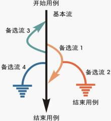

#### 测试流程
##### 测试计划
首先，根据用户需求报告中关于功能要求和性能指标的规格说明书，定义相应的测试需求报告，即制订黑盒测试的最高标准，以后所有的测试工作都将围绕着测试需求来进行，符合测试需求的应用程序即是合格的，反之即是不合格的；同时，还要适当选择测试内容，合理安排测试人员、测试时间及测试资源等。

##### 测试设计
将测试计划阶段制订的测试需求分解、细化为若干个可执行的测试过程，并为每个测试过程选择适当的测试用例（测试用例选择的好坏将直接影响到测试结果的有效性）。

##### 测试开发
建立可重复使用的自动测试过程。

##### 测试执行
执行测试开发阶段建立的自动测试过程，并对所发现的缺陷进行跟踪管理。测试执行一般由单元测试、组合测试、集成测试、系统联调及回归测试等步骤组成，测试人员应本着科学负责的态度，一步一个脚印地进行测试。

##### 测试评估
结合量化的测试覆盖域及缺陷跟踪报告，对于应用软件的质量和开发团队的工作进度及工作效率进行综合评价。

#### 优缺点
优点：适用于功能测试、可用性测试及可接受性测试;对照说明书测试程序功能;可测试长的、复杂的程序的工作逻辑，易被理解。

缺点：不可能进行完全的、毫无遗漏的输入测试，有一些软件Bug或人为设置的故障通过黑盒测试是无法检测出来的。正是因为黑盒测试的测试数据来自规格说明书，这一方法的主要缺点是它依赖于规格说明书的正确性。实际上，人们并不能保证规格说明书完全正确。如在规格说明书中规定了多余的功能，或是漏掉了某些功能，这对于黑盒测试来说是完全无能为力的。

# 密码学
## 对称加密与非对称加密
**对称加密**：也叫私钥加密，指加密和解密使用相同密钥的加密算法。例如DE、DESede、AES、IDEA、PBE\
**非对称加密**：也叫公钥加密，指加密和解密使用不同密钥的加密算法。

## AES加密

# 刷题
1. n从1开始，每个操作可以选择对n加1或者对n加倍。若想获得整数2013，最少需要多少个操作：( ) 

答：18\
2013 = 11111011101，一共11位，也就是向左挪了10次，即10次乘2操作，一共有9个1，减去原始存在的一个1（也就是1的变换操作为0次），也就是进行了8次加1的操作，所以10+8=18。

2. 排列组合
$$ A^{m}_{n} = \frac{n!}{(n - m)!} $$
$$ C^{m}_{n} = \frac{A^{m}_{n}}{m!} = \frac{n!}{m!(n - m)!} $$

3. 在文件局部有序或文件长度较小的情况下，最佳内部排序的方法是
**直接插入排序**

4. 系统测试使用哪种技术？
**黑盒测试**

5. 如何为文件A1设置自己可以执行的权限？
**chmod u+x A1**\\
Linux/Unix 的档案调用权限分为三级: 档案拥有者、群组、其他。
u 表示该档案的拥有者，
g 表示与该档案的拥有者属于同一个群体(group)者，
o 表示其他以外的人，
a 表示这三者皆是。

6. 在使用mkdir命令创建新的目录时，在其父目录不存在时先创建父目录的选项是
**mkdir -p dir1/dir2/dir3 嵌套创建3个目录**

7. 在数据库中，产生数据不一致的根本原因是
**数据冗余**

8. 下面哪些方法可以减少数据库死锁
* 尽量不要在一个事务中实现过于复杂的查询或更新操作
* 限制应用系统的并发访问量

9. 以下哪些属于进程间通信的方式？
* 消息队列
* 共享内存
* 管道

10. 在oracle数据库中，关于索引描述正确的是
* 对于大表，索引能明显提高查询效率
* 在数据表上创建唯一约束，会自动生成唯一索引
* 我们最常用到的是B-Tree索引

11. 关于测试用例，以下说法正确的是 
* 测试数据属于测试用例的组成部分

12. 下列哪种集合类中元素是有序的 
* TreeMap
* ConcurrentSkipList

13. 下列属于伟大的计算机科学家迪杰斯特拉(Dijkstra)的贡献的是 
* 提出了编程语言中goto有害论
* 提出了图论中的Dijkstra最短路径算法
* 提出了操作系统中的信号量和PV原语

14. 参考java相关知识，下列关于多线程说法正确的是 
* 继承Thread类与实现Runnable接口都可以实现多线程
* 哲学家就餐场景可能会发生死锁

15. 根据你所掌握的数据库知识，以下关于存储过程和函数的说法正确的有 
* 存储过程一般是作为一个独立的部分来执行，而函数可以作为查询语句的一个部分来调用。
* 一般而言，存储过程通常会在创建时即在服务器上进行了编译，效率更高。

16. 下列关于虚拟内存的描述正确的是：
* 解放物理空间的存储管理, 使得数据被分配的地址与逻辑上程序执行的上下文解耦。
* 提供进程之间的地址空间隔离，防止进程访问地址越界或非法。
* 简化在链接阶段分配地址空间。
